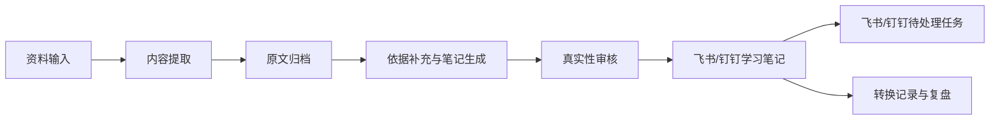
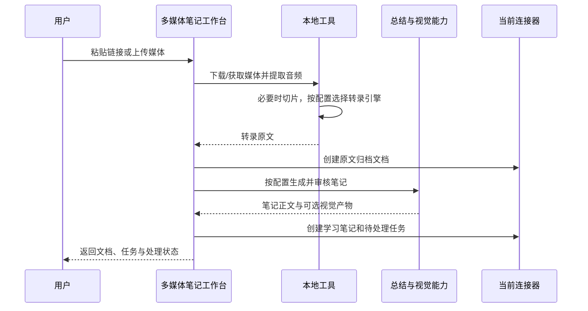

# Media Notes Workbench（多媒体笔记工作台）

> 让每份学习资料都留下可追溯的知识轨迹。

> 范围说明：本文只描述当前多媒体笔记主流程。仓库中的实验性页面、旁路模块或历史方案，
> 不代表本产品的可用功能。

Media Notes Workbench 是一个面向个人学习、研究和知识管理的本地内容处理工作台。它把分散在
B站、抖音、本地课程视频、录音和文档中的信息，转化为可复核的结构化学习笔记，并归档到
当前选定的飞书或钉钉连接器。

它的重点不是“快速生成一篇看起来完整的总结”，而是建立从原始资料、转录或解析原文、
提示词版本、学习笔记，到后续待办与处理状态的可追溯链路。

## 它解决什么问题

日常学习中的资料通常分散、难检索，也难形成后续行动：视频收藏后不再回看，课程录音
难以复盘，报告和课件很难提炼重点。

Media Notes Workbench 将这些重复环节收敛为一套工作流。工作台负责本机编排、证据留存和
结果追踪；转录、总结或图片理解是否调用云服务，由“参数配置”中的实际选择决定：



## 核心价值

| 价值           | 项目如何实现                                                                                    |
| -------------- | ----------------------------------------------------------------------------------------------- |
| 降低整理成本   | 自动完成下载或上传后的音频处理、转录、文档解析、笔记撰写与连接器归档。                          |
| 保留证据链     | 为可转录资料归档原文；文档笔记保留来源文件边界、原始文件指纹和解析质量信息。                    |
| 控制 AI 幻觉   | 笔记生成和审核均要求内容以原文、元数据和带 URL 的补充材料为依据；无法确认的信息应标记为待核对。 |
| 让笔记可复用   | 支持学习笔记、会议纪要两类提示词；草稿、发布版本、历史版本和差异均可管理。                      |
| 把学习变成行动 | 新生成的笔记可关联到当前连接器用户的当天待处理任务；平台内可统一追踪和标记完成。                |
| 适配不同运行环境 | 转录可在本机 Whisper 与腾讯云 ASR 之间选择；总结可使用平台能力或 OpenAI 兼容外部模型。     |

## 已支持的资料与功能

| 入口               | 输入                                      | 处理结果                                       | 适用场景                       |
| ------------------ | ----------------------------------------- | ---------------------------------------------- | ------------------------------ |
| 视频学习笔记       | B站或抖音视频链接                         | 转录原文、结构化学习笔记、可选关键画面增强、连接器文档 | 公开课程、教程、访谈、知识视频 |
| 本地视频学习笔记   | 本地视频文件，可一次上传多个              | 提取音轨、转录、学习笔记与连接器归档             | 课程录屏、讲座录像、屏幕录制   |
| 录音学习笔记       | 本地音频文件                              | 转录、学习笔记与连接器归档                       | 课堂录音、访谈、语音备忘       |
| 双源会议/培训笔记  | 同一场内容的一份视频和一份辅助录音        | 时间对齐、双路转写、关键截图、冲突清单与笔记   | 会议、内训、课程和演示录屏     |
| 文档学习笔记       | PDF、Word、PowerPoint，可一次融合多个文件 | 文档原文解析、学习笔记、连接器归档               | 报告、书籍、课件、课程资料     |
| 提示词配置         | 学习笔记或会议纪要模板                    | 草稿、已发布版本、版本历史与行级差异           | 固化个人或团队的笔记结构       |
| 转化记录           | 历次任务                                  | 结果、原文、提示词快照、待处理状态             | 回溯、筛选、复盘与批量处理     |
| 飞书链接收集箱     | 专用飞书会话中的 B站或抖音分享链接        | 自动创建视频学习笔记任务                       | 手机收藏、电脑本机处理         |
| 连接器与参数配置   | 飞书/钉钉授权、转录和总结模型配置         | 连接测试、输出位置和能力就绪检查               | 首次安装与日常切换             |

### 资料处理边界

- 平台视频仅接受 B站（含 b23.tv）和抖音链接；抖音分享短链和带 modal_id 的链接会先归一化。
- 本地视频、录音单个或累计上限为 10 GB；本地视频最多可选 10 个文件。
- 双源任务固定包含一份视频和一份辅助录音，两份文件累计不能超过 10 GB。
- PDF、Word、PowerPoint 单个或累计上限为 200 MB；一次最多可选 10 个文档。
- 文件会通过安全的 HTTPS 下载地址进入服务端处理；不接受私网或 localhost 地址。
- 仅应处理你有权访问、处理和保存的资料。

## 一次笔记是怎样生成的

### 视频、录音与本地视频



处理要点：

1. 平台视频使用 yt-dlp 获取媒体；遇到 B站登录限制时，可选择已登录的 Chrome、Safari、Edge 或 Firefox 作为 Cookie 来源。Cookie 由本机浏览器读取，项目不保存它。
2. ffmpeg 负责抽取音轨与长音频切片；转录使用本机 Whisper 或已配置的腾讯云 ASR。
3. 转录稿会先创建连接器原文归档，再由 AI 检索可核验的补充材料、依据当前已发布的提示词生成笔记。
4. 生成后的笔记会经过真实性与完整性检查；检查不能脱离原文补造事实。
5. 视频可按需提取关键画面并进行视觉分析或信息图增强；视觉处理失败不应阻断笔记正文归档。
6. 任务完成后会清理本机临时处理目录。

### 双源会议与培训

双源任务适用于同一场会议或培训同时存在视频和独立录音的情况。系统分别提取视频音轨与
辅助录音，以声音能量变化计算两者的时间偏移，然后生成两份带时间信息的转写结果。
时间重叠且内容一致的片段标记为“双路一致”；只在一路出现的内容保留来源标记；数字、
术语或表述冲突时同时保留两种说法并标记“待核对”，不自动猜测。

视频仍会进入关键画面提取和图片理解流程。辅助录音只能补充画面的语义上下文，不能恢复
原视频中已经丢失的像素、数字或表格细节。自动对齐无法达到可信阈值时，任务会停止融合，
用户可以检查是否传错文件，或改用手动偏移后重新提交。

### 文档、PDF 与课件

文档流程不需要本地 Whisper。系统将 PDF、Word 或 PowerPoint 的上传文件交给文档解析能力，
并把每个来源文件的名称、边界和指纹带入原文归档与笔记生成过程。对于解析内容过短或
质量不足的 PDF，结果应被视为需要 OCR 或人工复核，而不是完整可靠的原文。

文档笔记同样遵守来源边界：多文件融合时，不应伪造某一观点来自哪个文件或页码；无法
确认的内容会以“待人工确认”标识。

## 可追溯性与质量控制

项目将“生成得快”与“内容可信”分开处理：

- **输入可回溯**：转换记录保存资料类型、标题、结果状态；可打开或下载原文。
- **提示词可回溯**：每次生成会记录所用提示词快照与版本，避免后来改模板后无法解释旧笔记的生成依据。
- **真实性约束**：主体内容只应来自转录或解析原文、资料元数据和明确带来源 URL 的补充材料；不确定的名称、数字、结论或时间应明确标识，而不是猜测。
- **人工仍在闭环中**：AI 生成、外部补充、转录质量、图片版权和最终使用都需要人工检查。
- **待处理可追踪**：新生成的笔记可为当前连接器用户创建当天到期的待处理任务；在“转化记录”中标记已处理时，会同步完成关联任务。较早的历史记录不一定带有关联任务。

## 快速开始

### 1. 环境要求

| 组件                       | 用途                         | 适用范围               |
| -------------------------- | ---------------------------- | ---------------------- |
| Windows                    | 当前图形启动器运行环境       | 推荐的本地运行环境     |
| Node.js >= 22、npm >= 10   | 前后端运行时                 | 全部功能               |
| lark-cli 且已登录          | 飞书文档、任务与授权         | 飞书连接器             |
| dws 且已登录               | 钉钉文档、任务与授权         | 钉钉连接器             |
| yt-dlp                     | 获取平台视频媒体             | B站、抖音视频          |
| ffmpeg                     | 音频提取、格式处理与切片     | 视频、录音             |
| whisper-cpp 的 whisper-cli | 本机离线转录（可选）         | 视频、录音             |
| models/ggml-base-q5_1.bin  | 本地 Whisper 模型（可选）    | 视频、录音             |
| 腾讯云 COS + ASR            | 云端高质量转录（可选）       | 视频、录音             |

视频和录音至少需要 `ffmpeg`，并在本地 Whisper 或腾讯云 ASR 中选择一种转录方式。
平台视频还需要 `yt-dlp`；笔记归档和待处理任务依赖当前连接器的授权状态。

完成后检查本机环境：

```powershell
node --version
npm --version
yt-dlp --version
ffmpeg -version
whisper-cli --help
lark-cli auth status --json --verify
dws auth status --format json
```

> 不要将 Cookie、飞书/钉钉令牌、`.env.local`、原始媒体或临时文件提交到仓库。

### 2. 安装与启动

首次使用时，在项目根目录安装依赖：

```powershell
npm.cmd install
```

推荐直接双击 [启动多媒体笔记工作台.vbs](启动多媒体笔记工作台.vbs)。
Windows 启动器会先构建后端、启动前后端服务并等待页面真正可访问，再打开工作台；启动
窗口会展示进度、错误和诊断日志，不会把端口占用或进程创建失败误报为成功。
服务运行日志写入 `logs/dev.std.log`，启动状态与进程信息写入 `pids/`（均不应提交）。

也可以在终端启动：

```powershell
npm.cmd run start:windows
```

默认本地访问地址为：

```text
http://localhost:8081/app/app_179bn4jet6k/
```

端口和子路径以 `.env.local` 中的 `SERVER_PORT`、`CLIENT_DEV_PORT`、`CLIENT_BASE_PATH`
为准。启动过程会加载 `.env.local` / `.env`、初始化已声明的 AI 插件并生成本地运行配置。
若启动失败，优先查看 `logs/dev.std.log` 或启动器中的“查看诊断日志”。

需要关闭本项目本地服务时，双击 [停止多媒体笔记工作台.vbs](停止多媒体笔记工作台.vbs)，
或执行 `npm.cmd run stop:windows`。需要完整重启时，双击
[重启多媒体笔记工作台.vbs](重启多媒体笔记工作台.vbs)，或执行 `npm.cmd run restart:windows`。

> 端口冲突时先执行 `npm.cmd run stop:windows`；不要直接结束不属于本项目的 Node 进程。

## 使用方法

### 处理一份学习资料

1. 首次使用先打开“参数配置”，完成连接器、输出位置和转录/总结模型的就绪检查。
2. 打开首页，选择与资料相匹配的入口：平台视频、本地视频、录音、双源会议/培训或文档。
3. 粘贴完整视频地址，或选择本地文件上传。
4. 如有需要，先在“提示词配置”中选择学习笔记或会议纪要模板，保存后点击“发布生效”。仅保存的内容不会影响后续任务。
5. 提交任务，留意页面上的阶段、进度和错误提示。
6. 完成后打开当前连接器中的学习笔记、原文归档和待处理任务，人工核对关键结论、数据、术语与行动项。
7. 在“转化记录”中按资料类型、日期、成功/失败、待处理/已处理筛选；确认完成后标记为已处理。

### 从手机收集视频链接

1. 在飞书创建一个仅自己使用的群聊，例如“媒体收集箱”。不要将它用于多人聊天，因为该会话中的每条 B站或抖音链接都会进入处理队列。此能力依赖飞书连接器。
2. 在电脑端工作台首页打开“飞书收集箱”，填写该会话的 `oc_...` ID 并绑定。可运行以下命令查找会话 ID：

   ```bash
   lark-cli im +chat-search --as user --query 媒体收集箱 --format json
   ```

3. 绑定会将当时已有消息设为基线，不会补处理历史链接。之后在手机将 B站或抖音的分享链接发到该会话即可。
4. 本机服务每 30 秒检查一次新消息；也可在收集箱页面点击“立即检查”。任务结果仍在“视频学习笔记”与“转化记录”中查看。

收集器的绑定信息和已处理消息 ID 只保存在本机 `.media-inbox-state.json`，该文件已被 Git 忽略。电脑需要保持本机服务运行，飞书 CLI 也必须保持已授权状态。

## 项目结构与职责

```text
client/                         React 19 前端
  src/pages/                    各资料入口、参数配置、历史、手册与收集箱页面
server/                         NestJS 后端
  modules/note-jobs/            笔记任务编排、历史、模板与待处理同步
  modules/connectors/            飞书/钉钉授权、文档与待办输出
  modules/note-inbox/            飞书链接收集箱与去重账本
  capabilities/                 文档解析、检索、笔记、审核与知识图能力配置
  database/                     转换记录、提示词版本等数据结构与迁移
shared/api.interface.ts         前后端共享请求和响应类型
scripts/dev-windows.js          Windows 构建、启动、就绪探测与日志汇聚
scripts/workbench-launcher.hta  Windows 图形启动页
启动多媒体笔记工作台.vbs      Windows 双击启动器
docs/PROJECT_GUIDE.md           更完整的历史实现复盘与维护参考
```

前端通过短轮询获取异步任务进度；运行中的任务状态保存在服务进程内存中，因此服务重启后
尚未完成的任务不能继续查询。转换历史、提示词版本及相关追溯数据使用项目数据库保存。
连接器配置、外部模型密钥和收集箱状态保存在本机受限配置或被 Git 忽略的状态文件中。

## 常见问题与排查

| 现象                                | 优先检查                                                                          |
| ----------------------------------- | --------------------------------------------------------------------------------- |
| 平台视频无法下载或 B站出现 HTTP 412 | 确认链接有效；选择已登录对应平台的浏览器作为 Cookie 来源；检查 yt-dlp。           |
| 转录任务无法开始                    | 检查 ffmpeg、whisper-cli 和 models/ggml-base-q5_1.bin 是否存在。                  |
| 腾讯云 ASR 无法使用                 | 在“转录引擎”检查 SecretId、SecretKey、地域、COS 桶和连通性；也可切回本地 Whisper。 |
| 无法创建飞书文档或待办              | 运行 `lark-cli auth status --json --verify`，确认当前账号对目标内容有权限。       |
| 无法写入钉钉文档或待办              | 运行 `dws auth status --format json`，确认钉钉授权有效且执行人配置正确。          |
| 文档笔记内容很少或不完整            | 检查源文件是否为扫描件、加密文件或复杂排版；PDF 可考虑 OCR 后再处理，并人工核对。 |
| 修改提示词后笔记样式未变化          | 保存后还必须点击“发布生效”；草稿不会直接用于生成。                                |
| 历史记录找不到                      | 清除资料类型、日期、状态等筛选条件；记录按生成日期倒序展示。                      |
| 本地页面打不开                      | 查看 logs/dev.std.log，并确认 3000、8081 端口是本项目服务。                       |

以下就绪接口可帮助定位依赖问题：

```text
GET /api/runtime
GET /api/note-jobs/readiness
```

## 当前边界与已知限制

- 这是个人/本地内容工具，不是面向多人并发使用的生产级发布平台。
- 运行中的异步任务不具备服务重启恢复、队列调度、阶段重试或完整的并发控制。
- 本地 Whisper 使用 CPU 转录，长视频和大文件需要较长处理时间；腾讯云 ASR 和外部总结模型会将相应原文或音频交给云服务处理。
- 笔记输出依赖当前已授权的飞书或钉钉连接器；飞书链接收集箱仍只支持飞书会话。
- 文档解析和转录质量会直接影响笔记质量；扫描 PDF、专业术语、数字和代码需要重点复核。

## 面向维护者的验证方式

修改代码、插件配置或文档后，可按影响范围执行：

```bash
npm.cmd run type:check
npm.cmd run lint
npm.cmd test
npm.cmd run build:server
npm.cmd run build:client
git diff --check
```

对于功能验收，至少应完成一次真实闭环：提交一份有权使用的资料，核验当前连接器中的原文、学习笔记、
提示词快照、待处理状态和转化记录；平台链接、上传媒体、文档和双源资料应分别覆盖一次。

## 使用与合规原则

- 仅处理拥有合法访问、整理和保存权限的内容。
- 不将登录凭证、Cookie、敏感原文或个人数据提交到仓库。
- 将 AI 输出视为待审核材料，不将其当作无需核验的事实来源。
- 对外分享笔记前，人工核查引用、数据、图片版权、隐私和访问权限。

---

项目定位：**把资料转化为能够被追溯、复盘和继续行动的个人知识资产。**
