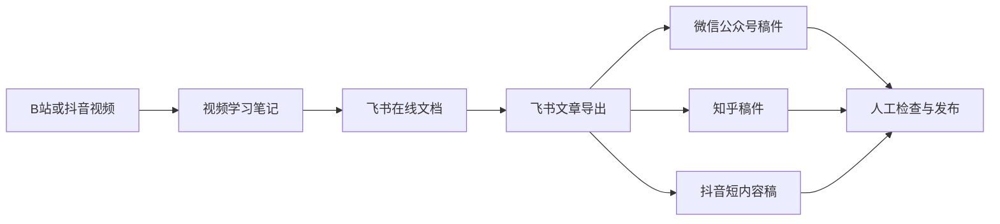
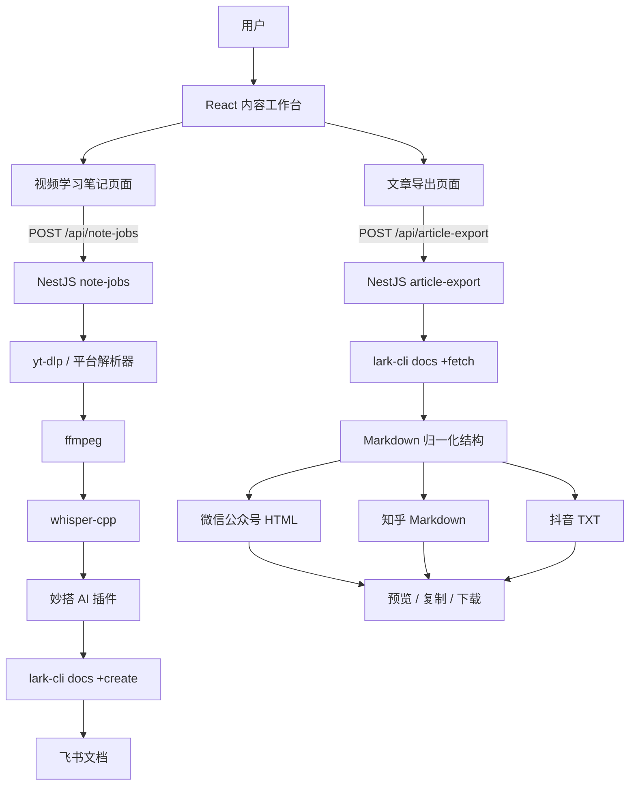
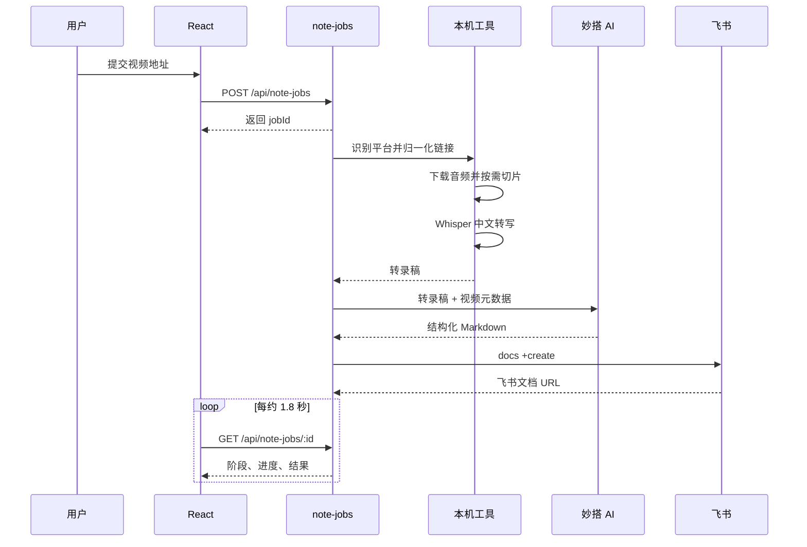
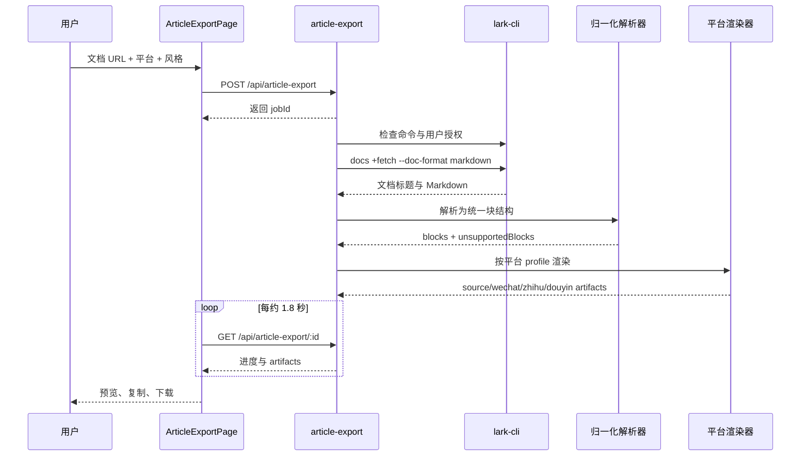

# 内容工作台：项目说明、实现复盘与维护手册

> 对应妙搭应用 `app_179bn4jet6k`，开发分支为 `sprint/default`。项目已经从单一的
> “B站学习笔记助手”演进为包含两个独立入口的内容工作台：
>
> 1. 视频学习笔记：B站/抖音视频 -> 音频 -> 转录稿 -> 结构化学习笔记 -> 飞书文档。
> 2. 飞书文章导出：飞书文档 -> 统一内容结构 -> 微信公众号/知乎/抖音稿件 ->
>    预览、复制或下载 -> 人工发布。

## 1. 项目现在解决什么问题

这个项目围绕同一条内容链路解决两个相邻问题。

第一类问题是“视频收藏了，但没有真正沉淀”。用户把 B站或抖音地址交给系统，
程序负责下载音频、本地转写、整理笔记并创建飞书文档，把重复劳动压缩成一次提交。

第二类问题是“内容已经写在飞书里，但发布到不同平台仍要重复排版”。同一篇文章
发到微信公众号、知乎和抖音时，标题、正文密度、格式能力和内容长度并不相同。
文章导出功能以飞书文档为唯一源头，为各平台生成独立稿件，但把最终发布动作留给
用户，避免在 MVP 阶段引入平台审核、登录态、接口权限和发布失败回滚等复杂问题。

两个功能形成了一条完整但不过度耦合的内容路径：



## 2. 产品形态与入口设计

### 2.1 为什么把入口拆开

文章导出功能第一次接入时，如果直接塞进原来的视频学习笔记页面，用户会同时看到
视频 URL、浏览器 Cookie、飞书文档 URL、目标平台、稿件风格等两套完全不同的配置。
功能虽然都叫“内容处理”，但任务心智并不相同：

| 功能 | 用户带来的输入 | 用户期待的结果 | 主要等待过程 |
|---|---|---|---|
| 视频学习笔记 | B站或抖音地址 | 一篇新的飞书学习笔记 | 下载、转写、AI 总结、创建文档 |
| 飞书文章导出 | 已有飞书文档地址 | 多个平台的可发布稿件 | 抓取、归一化、平台渲染 |

因此首页现在只承担“选择工作”的职责，不再承载具体表单。路由结构如下：

| 路由 | 页面 | 作用 |
|---|---|---|
| `/` | `EntryPage` | 内容工作台首页，展示两个独立功能入口 |
| `/video-notes` | `HomePage` | 视频学习笔记 |
| `/article-export` | `ArticleExportPage` | 飞书文档多平台导出 |

两个业务页面都提供“返回入口”和“切换到另一个功能”的按钮。这样既保留两个功能的
独立操作空间，又不会让用户进入页面后迷路。

### 2.2 当前产品边界

- 视频学习笔记会自动创建飞书文档。
- 文章导出只生成稿件，不调用微信公众号、知乎或抖音的自动发布接口。
- 微信公众号是文章导出的第一优先级，输出带内联样式的 HTML。
- 知乎输出保守的 Markdown，方便用户继续调整。
- 抖音输出短文本框架，包含导语、要点和配图建议，不假装还原长文章。
- 所有 AI 或转写结果都需要人工核对，尤其是术语、数字、代码和事实判断。

## 3. 总体技术架构

项目采用 React 19 + NestJS 的前后端结构，共享类型放在 `shared` 中。两个业务模块
都使用“创建异步任务 + 前端短轮询”的模式，但处理流水线相互独立。



### 3.1 共同设计

- 后端创建 `jobId` 后立即返回，耗时处理在后台继续执行。
- 任务状态保存在进程内存的 `Map` 中。
- 前端大约每 1.8 秒轮询一次任务状态。
- 前端展示阶段、进度、提示信息和最终结果。
- 后端重启后，内存任务会丢失。
- 当前未引入 WebSocket、消息队列或数据库，适合个人本地工具。

### 3.2 为什么两个模块不合并

两个模块虽然都使用 job 模式，但依赖和失败方式差异很大。视频任务依赖下载器、
音频工具、Whisper、AI 插件和飞书创建能力；文章导出只依赖飞书读取和本地渲染。
保持模块独立可以避免一个功能的环境检查、状态字段和异常处理污染另一个功能。

## 4. 功能一：视频学习笔记

### 4.1 支持范围

- B站普通视频页和 `b23.tv` 短链。
- 抖音手机分享短链和带 `modal_id` 的网页分享页。
- 自动读取视频标题、作者、时长和音频。
- 超大音频通过 ffmpeg 切片。
- 使用本地 `whisper-cpp` 生成中文转录稿。
- 使用妙搭 `@official-plugins/ai-text-generate` 整理学习笔记。
- 以当前飞书用户身份创建在线文档并返回链接。

项目不使用 OpenAI API Key。原始音频与转写过程留在本机，妙搭 AI 接收的是转录文本
和视频元数据，不接收浏览器 Cookie。

### 4.2 任务阶段



处理细节：

1. 后端检查 `yt-dlp`、`ffmpeg`、`whisper-cli`、Whisper 模型和 `lark-cli`。
2. 链接先判断平台和分享格式，再归一化为可处理地址。
3. 下载阶段提取音频；文件超过 24 MB 时按 1200 秒切片。
4. Whisper 使用中文、无时间戳、CPU 模式逐段转写。
5. 妙搭插件根据固定模板生成 Markdown。
6. `lark-cli docs +create` 创建飞书文档并返回地址。
7. 成功或失败后，任务临时目录都会清理。

### 4.3 笔记模板的质量约束

当前笔记模板顺序为：

- 一句话标题
- 笔记总览
- 核心结论
- 知识结构
- 原理理解
- 方法步骤
- 实战案例
- 易错点
- 行动清单
- 复习问题
- 反思总结
- 依据备注（可选）

比章节数量更重要的是三条边界：

1. 只使用转录稿和视频元数据中存在的事实。
2. 视频没有讲到的章节写“本视频未展开”，不为了完整而补造。
3. AI 补充必须说明依据和补充理由。

这次实践说明，AI 内容质量主要由输入材料、结构约束和失败边界决定，不是只要换一个
更强模型就会自然变好。

## 5. 功能二：飞书文档多平台稿件导出

### 5.1 MVP 用户流程

1. 从工作台首页进入“飞书文档多平台导出”。
2. 粘贴飞书文档 URL。
3. 选择微信公众号、知乎、抖音中的一个或多个目标平台。
4. 选择是否包含图片。
5. 选择“编辑稿”或“简洁稿”。
6. 点击生成，等待环境检查、文档抓取、结构归一化和平台渲染。
7. 在平台标签之间切换预览。
8. 根据需要复制稿件或下载 `.html`、`.md`、`.txt` 文件。
9. 人工检查后，粘贴或上传到目标平台发布。

默认勾选微信公众号和知乎，默认风格为“编辑稿”，默认包含图片。

### 5.2 后端任务流水线



任务状态依次为：

| 状态 | 进度参考 | 含义 |
|---|---:|---|
| `queued` | 2% | 已创建任务 |
| `checking` | 8% | 检查 `lark-cli` 与用户授权 |
| `fetching` | 20% | 获取飞书文档 Markdown |
| `normalizing` | 48% | 解析并归一化内容 |
| `rendering` | 64% | 生成各平台稿件 |
| `completed` | 100% | artifacts 可用 |
| `failed` | 保留当前进度 | 返回明确错误 |

### 5.3 统一内容结构

飞书文档先通过 `lark-cli docs +fetch --as user --doc-format markdown` 获取，再由
`parseMarkdownDocument` 转成内部块结构。当前支持：

| 块类型 | 输入示例 | 平台处理 |
|---|---|---|
| `heading` | `#` 到 `######` | 保留层级并按平台调整样式 |
| `paragraph` | 普通段落 | 保留行内链接、强调和代码 |
| `list` | 有序/无序列表 | HTML 列表或 Markdown 列表 |
| `quote` | `>` 引用 | 公众号高亮引用，知乎 Markdown 引用 |
| `code` | fenced code block | 公众号深色代码块，知乎代码围栏 |
| `image` | Markdown 图片 | 按 `includeImages` 决定是否输出 |
| `divider` | `---` | 输出分隔线 |
| `table` | Markdown 表格 | 公众号 HTML 表格，知乎 Markdown 表格 |
| `unsupported` | 白板、任务等复杂 XML 块 | 显示“待人工处理”提示并写入清单 |

标题优先使用飞书返回的文档标题，其次使用第一处标题，最后使用首段文本。渲染前会
移除与文档标题重复的首个标题块，避免稿件出现两个相同标题。

这里有一个与最初方案不同的现实取舍：当前实现以 Markdown 作为飞书读取结果，再做
轻量解析，并不是完整的飞书 Docx AST。它足以覆盖常见文章结构，开发和调试成本也较低；
代价是白板、嵌入表格、多维表格、任务等复杂块只能降级提示。

### 5.4 平台渲染策略

#### 微信公众号

- 输出格式为 HTML。
- 所有关键排版都使用内联样式，减少复制到编辑器后的样式丢失。
- 参考开源
  [`wechat-article-publisher-skill`](https://github.com/iamzifei/wechat-article-publisher-skill)
  的兼容策略：首个 H1 作为文章标题且不重复进入正文、保留 HTML 内联样式、
  表格与图片，并为后续草稿发布保留稳定结构。
- 标题、段落、列表、引用、代码、表格、图片和分隔线分别渲染。
- 中文正文使用接近 1.9 倍行高和轻量字间距，章节标题使用左侧强调线，
  次级标题使用暖色分隔线。
- 代码块使用深色背景，引用块使用暖色边框和浅色底，表格使用浅暖色表头。
- 图片使用响应式宽度，避免超出公众号正文区域。
- 下载文件扩展名为 `.html`。

公众号复制会同时写入 `text/html` 与 `text/plain` 两种剪贴板内容。支持
`ClipboardItem` 的浏览器可以直接粘贴富文本；不支持时回退为普通文本复制。
微信公众号仍是第一优先级，但最终兼容性取决于浏览器剪贴板权限和公众号编辑器本身，
人工验收时必须真实粘贴一次，不能只看站内预览。

#### 知乎

- 输出格式为 Markdown。
- 保留标题、来源、列表、引用、代码围栏、图片和表格。
- 预览使用同一份内部块结构生成 HTML，不直接拿 Markdown 当最终视觉结果。
- 下载文件扩展名为 `.md`。

知乎采用更保守的输出，是因为 Markdown 更便于迁移和二次编辑，复杂 HTML 在不同
编辑器中的兼容性反而更难控制。

#### 抖音

- 输出格式为纯文本。
- 从前两个正文段落中提取导语。
- 从标题和列表中提取 3 到 5 个要点。
- 编辑稿提供更完整的要点，简洁稿进一步压缩。
- 结尾附带封面和配图数量建议。
- 下载文件扩展名为 `.txt`。

抖音稿件当前是“短内容骨架”，不是完整的视频脚本生成器，也没有调用 AI 对长文进行
深度重写。这一版优先保证可控和可解释。

### 5.5 Artifact 数据结构

每个任务至少返回一个 `source` artifact，并为用户选择的平台返回对应 artifact：

```ts
interface ArticleArtifact {
  platform: 'source' | 'wechat' | 'zhihu' | 'douyin';
  format: 'html' | 'markdown' | 'txt';
  copyContent: string;
  downloadFileName: string;
  previewHtml?: string;
  unsupportedBlocks: string[];
}
```

- `source` 保存飞书返回的原始 Markdown，便于对照。
- `copyContent` 是复制和下载使用的最终内容。
- `previewHtml` 只用于站内预览。
- `unsupportedBlocks` 汇总无法稳定转换的复杂块，以及用户主动关闭图片后的提醒。
- 文件名格式为 `YYYY-MM-DD-平台-标题.扩展名`。
- 标题中的 `\ / : * ? " < > |` 会替换为 `-`，并限制长度。

### 5.6 复制、下载和预览

- 预览：页面内提供快速预览；点击结果卡片的“预览”会打开独立大尺寸 Dialog，
  可以完整滚动检查稿件，并在弹窗中直接复制或下载。
- 复制：微信稿件优先使用 Clipboard API 写入富文本 HTML 和纯文本回退；
  其他平台复制 `copyContent`；失败时显示明确提示。
- 下载：前端用 `Blob` 创建临时 URL，再通过 `a[download]` 保存文件。
- 平台切换：结果区使用标签页，默认优先展示微信公众号稿件。
- 降级提示：若存在不支持的块，页面会提醒用户发布前人工处理。

当前后端也提供单个 artifact 查询接口，但前端主要从轮询得到的 job 中直接读取
artifacts，减少额外请求。

### 5.7 图片处理的真实边界

当前实现并没有把飞书图片下载到工作目录，也没有把图片重新上传到公共图床。系统只是
保留 `docs +fetch` 输出中的 Markdown 图片 URL。

这意味着：

- 站内预览在 URL 可访问时可以显示图片。
- 复制到外部平台后，图片链接可能因权限或时效失效。
- 关闭“包含图片”后，图片不会进入稿件，并在 `unsupportedBlocks` 中提示。
- 正式发布前，应检查图片并按目标平台要求重新上传。

如果后续要把图片能力做稳，需要增加 `lark-cli docs +media-download`、本地资源映射、
目标平台上传或可控图床托管，以及临时文件清理。目前不能把这一项描述为已经完成。

## 6. API 与共享类型

### 6.1 视频任务 API

| 方法 | 地址 | 用途 |
|---|---|---|
| GET | `/api/note-jobs/readiness` | 检查视频处理依赖 |
| POST | `/api/note-jobs` | 创建视频笔记任务 |
| GET | `/api/note-jobs/:id` | 查询任务状态和飞书文档地址 |

创建任务示例：

```json
{
  "url": "https://www.bilibili.com/video/BV1AycQzMEZh",
  "cookieBrowser": "chrome"
}
```

`cookieBrowser` 可选值为 `chrome`、`safari`、`edge`、`firefox`。

### 6.2 文章导出 API

| 方法 | 地址 | 用途 |
|---|---|---|
| GET | `/api/article-export/readiness` | 检查 `lark-cli` 和用户授权 |
| POST | `/api/article-export` | 创建文章导出任务 |
| GET | `/api/article-export/:id` | 查询任务状态与全部 artifacts |
| GET | `/api/article-export/:id/artifacts/:platform` | 获取单个平台 artifact |

创建任务示例：

```json
{
  "sourceDocUrl": "https://my.feishu.cn/docx/...",
  "targetPlatforms": ["wechat", "zhihu", "douyin"],
  "includeImages": true,
  "preferredStyle": "editorial"
}
```

参数规则：

- `sourceDocUrl` 不能为空。
- `targetPlatforms` 至少选择一个，只允许 `wechat`、`zhihu`、`douyin`。
- `includeImages` 默认为 `true`。
- `preferredStyle` 默认为 `editorial`，另一个值为 `concise`。

前后端类型统一定义在 `shared/api.interface.ts`。修改字段时必须同时检查 Controller、
Service、前端 API 和页面，避免请求与响应结构漂移。

## 7. 运行前提

### 7.1 平台与运行时

- macOS（当前实战环境）
- Node.js `>= 22`
- npm `>= 10`
- 可访问 B站、抖音、妙搭和飞书开放平台的网络
- 对源视频、飞书文档和目标平台内容拥有合法使用权限

最近记录的验证环境为 Node.js 24.7.0、npm 11.5.1、yt-dlp 2026.06.09、
FFmpeg 8.0、lark-cli 1.0.63。版本会随本机环境变化，应以实际命令输出为准。

### 7.2 本机命令

```bash
node --version
npm --version
yt-dlp --version
ffmpeg -version
whisper-cli --help
lark-cli --version
lark-cli auth status --json --verify
```

视频功能需要 `yt-dlp`、`ffmpeg`、`whisper-cpp` 和 Whisper 模型；文章导出功能只要求
`lark-cli` 可用且用户授权有效。

macOS 可通过 Homebrew 安装常见依赖：

```bash
brew install yt-dlp ffmpeg whisper-cpp
```

不要把飞书令牌、Cookie 或其他访问凭证写进仓库。

### 7.3 Whisper 模型

模型文件位置：

```text
models/ggml-base-q5_1.bin
```

后端基于 `process.cwd()` 拼接模型路径，因此必须从项目根目录启动。

### 7.4 妙搭配置

项目元数据位于 `.spark/meta.json`，应用 ID 为 `app_179bn4jet6k`。视频笔记使用的 AI
插件实例位于：

```text
server/capabilities/bilibili-note-writer.json
```

## 8. 安装与启动

### 8.1 安装

```bash
cd "/Users/yangjie/YJ/codex_workspace/b站学习笔记项目"
npm install
```

### 8.2 检查端口

默认后端端口为 3000，本地前端使用 8081：

```bash
lsof -nP -iTCP:3000 -sTCP:LISTEN
lsof -nP -iTCP:8081 -sTCP:LISTEN
```

不要看到占用就直接杀进程。先确认是否为本项目的旧开发服务。

### 8.3 推荐启动

双击 `启动B站学习笔记助手.command`，或执行：

```bash
CLIENT_DEV_PORT=8081 npm run dev:local
```

访问地址：

```text
http://localhost:8081/app/app_179bn4jet6k/
```

启动器会等待前后端准备完成后再打开页面。若分开启动：

```bash
# 终端 1
npm run dev:server

# 终端 2
CLIENT_BASE_PATH=/app/app_179bn4jet6k \
CLIENT_DEV_PORT=8081 \
npm run dev:client
```

在开发环境调 API 时，优先通过前端开发服务器访问 `/api`，让代理补齐平台所需请求头。

## 9. 两个功能的使用说明

### 9.1 生成视频学习笔记

1. 进入 `/video-notes`。
2. 确认本机处理环境已就绪。
3. 粘贴 B站或抖音地址。
4. 匿名访问失败时选择已登录对应平台的浏览器。
5. 点击“开始生成学习笔记”。
6. 等待下载、转写、总结和写入飞书。
7. 打开飞书文档，人工核对内容。

### 9.2 生成多平台文章稿件

1. 进入 `/article-export`。
2. 确认飞书导出环境已就绪。
3. 粘贴有权限访问的飞书文档地址。
4. 选择目标平台、图片选项和稿件风格。
5. 点击生成。
6. 在结果标签中对照原文和各平台稿件。
7. 复制或下载需要的稿件。
8. 在目标平台重新检查图片、标题、格式和平台规范后手动发布。

## 10. 实战过程与关键经验

### 10.1 视频 Demo

测试视频为 `BV1AycQzMEZh`，时长 2 分 49 秒，内容主要是 Agent Memory 课程导论。

这次 Demo 验证了：

- 匿名状态可读取元数据并下载音频。
- Whisper 可以完成中文转写。
- AI 模板不会把课程导论扩写成不存在的技术原理。
- 未讲到的案例会标记“本视频未展开”。
- 课程福利不会挤占正文核心结构。

示例飞书文档：

```text
https://my.feishu.cn/docx/ZOTcdwv8RoNxcPxPJuocHbIDndf
```

### 10.2 文章导出 MVP

文章导出从一个明确的产品边界开始：先解决“生成可用稿件”，不急着解决“自动发布”。
实现顺序是：

1. 在共享类型中定义请求、任务状态和 artifact。
2. 新增独立的 `article-export` NestJS 模块。
3. 用 `lark-cli docs +fetch` 获取 Markdown。
4. 写轻量解析器，统一常见文章块。
5. 为微信、知乎、抖音分别实现渲染 profile。
6. 前端实现平台选择、风格选择、轮询、预览、复制和下载。
7. 根据实际使用反馈，将入口从视频页面中拆出，新增独立工作台首页。

这次实现最重要的产品经验是：功能相关，不等于入口应该混在一起。用户来做“视频转笔记”
和“文档转平台稿”时，起点、配置和完成标准都不同。把入口拆开后，页面信息密度更低，
返回路径和功能切换也更明确。

### 10.3 为什么先做手动发布

自动发布看起来只是多一个按钮，实际会引入：

- 各平台开放接口申请和权限审核。
- 用户登录态、授权过期和多账号管理。
- 图片上传与素材库映射。
- 草稿、正式发布、审核失败等状态同步。
- 重试、幂等、部分成功和回滚。
- 平台规则变化后的维护成本。

MVP 先输出稳定稿件，把最后一步交给人，可以更快验证“生成的内容是否真的有用”。
只有当稿件质量、使用频率和平台优先级得到验证后，自动发布才值得进入下一阶段。

## 11. 已解决的问题与复盘

### 11.1 B站 HTTP 412

现象：

```text
ERROR: [BiliBili] ... HTTP Error 412: Precondition Failed
```

处理方式是补齐 Referer、Origin 和浏览器 User-Agent，增加重试，并允许从 Chrome、
Safari、Edge、Firefox 读取 Cookie。系统仍先匿名尝试，Cookie 只作为兜底。

经验：敏感登录态不应成为默认依赖，也不应由项目保存。

### 11.2 抖音链接形态不一致

手机分享短链和网页分享页不能直接走完全相同的解析入口。现在先做链接归一化，再进入
下载流程；Cookie 过期时提示用户在普通 Chrome 窗口刷新抖音。

经验：入口兼容与登录态失败是两类问题，应分别处理和提示。

### 11.3 端口冲突与启动时序

8080 被占用后，本地前端改为 8081。启动器还增加了就绪等待，避免浏览器已经打开，
服务却仍在安装或初始化。

经验：本地工具的“启动体验”也是产品的一部分。很多所谓连接故障只是服务尚未就绪。

### 11.4 子路径导致 NotFound

妙搭本地地址位于 `/app/app_179bn4jet6k/`，不是根路径。项目修正 Vite root、HTML 入口
和 Router basename 后，前端路由才能在子路径正常工作。

经验：平台应用的静态资源路径、开发服务器路径和前端 Router 必须使用同一 base path。

### 11.5 AI 笔记能生成但不好用

第一版模板追求章节完整，结果会混入课程介绍、福利和空泛补充。新版模板把真实性、
章节边界、总览和复习动作写成明确约束。

经验：生成内容的“边界控制”比“写得更多”更重要。

### 11.6 两个功能入口混在一起

文章导出接入后，原有页面同时承担两套任务，用户难以快速判断应该从哪里开始，也缺少
明确的返回和切换路径。

处理方式：

- 新增独立 `EntryPage` 作为首页。
- 视频功能固定到 `/video-notes`。
- 文章导出固定到 `/article-export`。
- 两个页面都增加返回首页和互相切换入口。

经验：产品导航应该按用户任务拆分，而不是按技术模块是否相似来拆分。

### 11.7 规划能力与实际能力需要分开记录

最初方案希望完整覆盖飞书 AST，并下载图片资源。为了先跑通 MVP，当前实现选择了
Markdown 抓取和轻量解析，图片也暂时保留原 URL。

经验：文档必须明确区分“目标架构”和“已上线实现”。否则维护者会误以为复杂块与图片
已经完全可靠，测试时就会得到错误预期。

## 12. 日志与故障排查

统一开发日志：

```text
logs/dev.std.log
```

建议排查顺序：

1. 确认正在使用哪个功能和对应 readiness 接口。
2. 检查 3000、8081 端口和开发服务状态。
3. 查看任务 ID、stage、message 和后端错误日志。
4. 视频问题再检查 yt-dlp、ffmpeg、Whisper 和模型路径。
5. 飞书问题检查 `lark-cli auth status --json --verify`。
6. 文章导出问题先用 `lark-cli docs +fetch --doc "<URL>" --doc-format markdown`
   验证源文档是否可读。
7. 若稿件缺内容，检查源 Markdown 是否包含不支持的飞书复杂块。
8. 若图片在外部平台不可见，按图片权限/时效问题处理，不要先怀疑文本渲染器。

视频 readiness：

```text
GET /api/note-jobs/readiness
```

文章导出 readiness：

```text
GET /api/article-export/readiness
```

## 13. 测试与质量检查

常用检查：

```bash
npm run type:check
npm run type:check:client
npm run lint
npm run build:server
npm run build:client
git diff --check
```

修改 AI 插件配置后额外检查 JSON：

```bash
node -e "JSON.parse(require('fs').readFileSync('server/capabilities/bilibili-note-writer.json','utf8')); console.log('ok')"
```

文章导出当前需要重点人工验收：

1. 准备一篇包含标题、段落、列表、引用、代码、图片和表格的飞书文档。
2. 同时生成微信、知乎和抖音稿件。
3. 检查标题是否重复、列表是否丢失、表格是否可读。
4. 将微信稿件真实复制到公众号编辑器，验证内联样式。
5. 将知乎 Markdown 粘贴到目标编辑器，检查代码、引用和表格。
6. 检查抖音稿是否足够短，且没有伪造原文没有的观点。
7. 关闭图片后重新生成，确认图片消失且有降级提示。
8. 使用含白板或嵌入资源的文档，确认 `unsupportedBlocks` 可见。

当前仓库还没有覆盖 article-export 的自动化单元测试和集成测试。后续至少应补：

- 飞书 URL 输入校验。
- Markdown 块解析。
- 标题去重。
- 微信/知乎/抖音渲染器快照或结构断言。
- 不支持块降级。
- 文件名清洗。
- mock `lark-cli docs +fetch` 的 job 状态流转测试。
- 前端复制、下载、切换平台的冒烟测试。

## 14. 安全、合规与限制

### 14.1 通用要求

- 只处理有权使用和发布的内容。
- 遵守 B站、抖音、微信公众号、知乎和飞书的服务条款。
- 不提交 Cookie、访问令牌、`.env.local`、音频或任务临时文件。
- AI 和转写结果必须人工核对。
- 人工发布前检查引用、图片版权和平台规范。

### 14.2 当前技术限制

- 两类任务状态都只保存在内存，服务重启后不可恢复。
- 没有任务队列、并发限制和阶段重试。
- Whisper 固定为中文 CPU 模式。
- `lark-cli` 依赖当前机器的飞书用户登录态。
- 文章导出不是完整飞书 AST，复杂资源块会降级。
- 飞书图片没有下载和重新托管，复制到外部平台后可能失效。
- 微信 HTML 的最终兼容性仍需在真实公众号编辑器中验收。
- 抖音稿是规则提取的短内容骨架，不是 AI 深度改写脚本。
- 没有自动发布、发布状态跟踪或失败回滚。
- 当前自动化测试覆盖不足。

这些限制决定了项目目前是“个人本地内容工具”，还不是可以直接开放给多人使用的
生产级内容发布平台。

## 15. 关键代码位置

| 文件 | 作用 |
|---|---|
| `client/src/app.tsx` | 首页、视频页、文章导出页的路由 |
| `client/src/pages/EntryPage/EntryPage.tsx` | 双功能工作台入口 |
| `client/src/pages/HomePage/HomePage.tsx` | 视频学习笔记页面 |
| `client/src/pages/ArticleExportPage/ArticleExportPage.tsx` | 文章导出配置、轮询、预览、复制和下载 |
| `client/src/api/index.ts` | 两类任务的前端 API |
| `server/modules/note-jobs/note-jobs.service.ts` | 视频任务完整编排 |
| `server/modules/note-jobs/note-jobs.controller.ts` | 视频任务接口 |
| `server/modules/article-export/article-export.service.ts` | 飞书抓取、任务状态和 artifact 生成 |
| `server/modules/article-export/article-export.utils.ts` | Markdown 解析、平台渲染和降级处理 |
| `server/modules/article-export/article-export.controller.ts` | 文章导出接口 |
| `server/capabilities/bilibili-note-writer.json` | 视频笔记 AI 模板 |
| `shared/api.interface.ts` | 前后端共享请求、任务和 artifact 类型 |
| `client/src/index.tsx` | Router basename 处理 |
| `scripts/dev-local.js` | 本地环境同步、启动和日志 |
| `启动B站学习笔记助手.command` | macOS 一键启动 |

## 16. 维护修改指南

### 16.1 新增一个文章目标平台

1. 在 `ArticlePlatform` 中增加平台值。
2. 更新请求类型和后端平台白名单。
3. 在 `article-export.utils.ts` 中新增渲染函数。
4. 在 `buildPlatformArtifact` 中生成正确格式的 artifact。
5. 在前端增加平台选项、名称和说明。
6. 增加对应预览、复制和下载验收。
7. 更新本文档中的平台能力和限制。

不要直接复用微信公众号 HTML 作为所有平台输出。应先明确新平台支持什么格式、典型
内容长度、图片规则和用户后续编辑方式。

### 16.2 新增一种内容块

1. 扩展内部 `ArticleBlock` 联合类型。
2. 在 `parseMarkdownDocument` 中识别输入。
3. 分别实现 HTML、Markdown 和纯文本渲染。
4. 决定无法表达时的降级策略。
5. 更新 `unsupportedBlocks` 逻辑。
6. 增加含该块的测试文档和自动化测试。

### 16.3 调整页面入口

路由入口集中在 `client/src/app.tsx`。新增或调整页面时，应同时检查：

- 首页是否仍能清楚解释功能差异。
- 业务页能否返回首页。
- 两个功能之间能否直接切换。
- 妙搭子路径 basename 下是否仍能访问。
- 移动端按钮和卡片是否可用。

## 17. 后续演进路线

### 第一阶段：把当前 MVP 做稳

1. 补齐 article-export 单元测试、集成测试和前端冒烟测试。
2. 用真实公众号编辑器完成复制兼容性验收并修正 HTML。
3. 增加任务过期清理，避免内存 Map 长期增长。
4. 保存关键阶段耗时和失败原因。
5. 优化飞书授权失败时的操作指引。

### 第二阶段：提高内容保真度

1. 从轻量 Markdown 解析升级为更完整的飞书块结构映射。
2. 使用 `docs +media-download` 获取图片并建立本地资源映射。
3. 设计可控的图片上传或托管流程。
4. 增强嵌套列表、复杂表格、公式和附件处理。
5. 为不同公众号风格提供可配置模板。

### 第三阶段：提高任务可靠性

1. 引入持久化 job 与并发队列。
2. 保存转录稿、源文档快照和 artifacts。
3. 支持从失败阶段重试。
4. 增加任务历史、重新下载和再次导出。
5. 重新设计多人环境下的飞书身份和资源隔离。

### 第四阶段：谨慎评估自动发布

只有当手动导出的使用频率和稿件质量得到验证后，再评估：

1. 微信公众号草稿箱接口。
2. 图片素材上传与 URL 替换。
3. 多账号授权。
4. 草稿、审核、发布状态同步。
5. 幂等、重试和部分失败处理。

自动发布不是简单地“再接一个 API”，而是一套新的权限与状态系统。它应作为独立阶段
设计，而不是继续堆进当前 MVP。

## 18. 总结

项目最初解决的是“把视频变成学习笔记”，现在又向前走了一步：把飞书中的成熟内容
转换成适合不同平台的稿件。两条流水线连接起来后，已经形成从内容获取、知识沉淀到
人工发布的基础闭环。

这次新增功能带来的经验不只是一组代码：

- 产品上，相关功能也需要按用户任务拆分入口。
- 架构上，可以复用 job 模式，但不要强行合并不同流水线。
- 内容上，平台差异应该由独立 renderer 处理。
- 工程上，先做可控的降级，再逐步追求复杂块和图片保真。
- 范围上，先验证稿件价值，再承担自动发布的权限和状态复杂度。
- 文档上，必须区分已经实现、当前限制和未来规划。

当前版本已经能完成“飞书文档 -> 多平台稿件 -> 预览/复制/下载 -> 人工发布”的
MVP 闭环。下一步最值得投入的不是立刻扩更多平台，而是补齐真实编辑器验收、图片链路、
自动化测试和任务持久化，把已经跑通的能力做稳。
