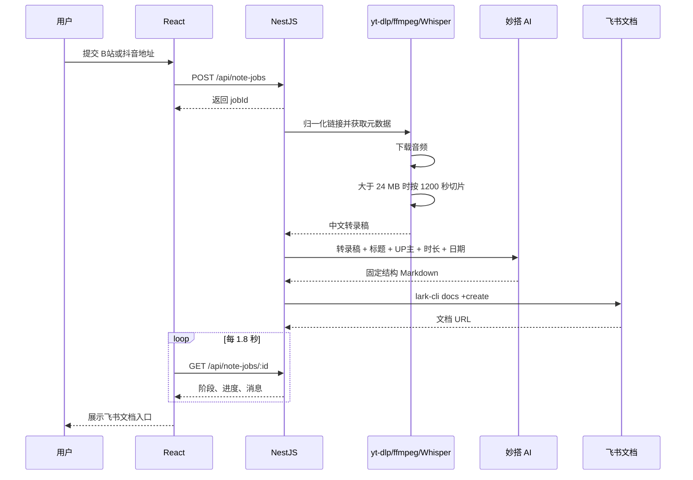

# B站和抖音学习笔记助手：项目说明与维护手册

> 对应妙搭应用 `app_179bn4jet6k`，开发分支为 `sprint/default`。项目把 B站和抖音视频统一转换为音频、转录稿、Markdown 学习笔记和飞书在线文档。

## 1. 项目解决什么问题

很多视频收藏最后只剩下一串链接。B站收藏夹里有教程，抖音里有短视频讲解，真正回头学习时，经常卡在三个动作上：找到视频、抄下重点、整理成能复习的笔记。

这个项目把机械步骤交给程序：用户粘贴视频地址，系统先在本机完成下载和转写，再调用妙搭内置 AI 整理学习笔记，最后以当前登录用户的身份创建飞书文档。

项目不依赖 OpenAI API Key。音频转写使用本地 `whisper-cpp`，笔记生成使用妙搭插件 `@official-plugins/ai-text-generate`，飞书文档由 `lark-cli docs +create` 创建。

## 2. 现在能做什么

- 支持 B站普通视频链接和短链，例如 `bilibili.com/video/...`、`b23.tv/...`
- 支持抖音两种常见输入
  - 手机分享短链，例如 `https://v.douyin.com/.../`
  - 网页分享页，例如 `https://www.douyin.com/jingxuan?modal_id=...`
- 自动从链接里提取元数据、标题、作者、时长和正文音频
- 在本机完成音频切片和 Whisper 转写
- 使用统一的学习笔记模板生成 Markdown
- 按当前登录的飞书用户身份创建文档并返回链接
- 在页面上先显示 loading，等后端和前端准备完成后再开放操作，避免一启动就出现“无法连接”

## 3. 系统架构


### 3.1 分层说明

| 层 | 组件 | 责任 |
|---|---|---|
| 前端 | React、Vite | 收集视频地址和 Cookie 来源，展示环境状态、进度、错误与文档链接 |
| API | NestJS | 校验输入，创建任务，编排处理流水线，提供轮询接口 |
| 归一化 | 链接解析与参数清洗 | 识别 B站和抖音输入，统一提取最终可处理地址 |
| 下载 | yt-dlp、ffmpeg | 读取元数据、提取音频，必要时按 20 分钟切片 |
| 转写 | whisper-cpp | 使用本地模型离线生成中文转录稿 |
| 总结 | 妙搭 AI 插件 | 按固定模板将转录稿整理成 Markdown |
| 发布 | lark-cli | 以当前飞书用户身份创建文档并返回 URL |

### 3.2 关键设计取舍

- 音频和转写留在本机，减少原始内容外传，也省去语音 API 成本。
- AI 只接收转录文本和视频元数据，不接收浏览器 Cookie。
- 任务状态保存在进程内存中，结构简单，适合个人本地工具；后端重启后任务记录会丢失。
- 每个任务使用独立临时目录，成功或失败都会在 `finally` 中清理。
- 前端轮询任务状态，没有引入 WebSocket，调试成本较低。
- 启动时先等待后端和前端都准备好，再自动打开页面，减少“页面开了但服务还没起”的假故障。

## 4. 运行前提

### 4.1 平台与运行时

- macOS（当前实战环境）
- Node.js `>= 22`
- npm `>= 10`
- 可访问 B站、抖音、妙搭和飞书开放平台的网络
- 对目标视频拥有合法使用权限

当前验证环境为 Node.js 24.7.0、npm 11.5.1、yt-dlp 2026.06.09、FFmpeg 8.0、lark-cli 1.0.63。

### 4.2 本机命令

确保以下命令可在终端直接执行：

```bash
node --version
npm --version
yt-dlp --version
ffmpeg -version
whisper-cli --help
lark-cli --version
```

macOS 可使用 Homebrew 安装常见依赖：

```bash
brew install yt-dlp ffmpeg whisper-cpp
```

`lark-cli` 请按妙搭/飞书 CLI 的安装方式完成安装，不要把访问令牌写进仓库。

### 4.3 Whisper 模型

模型文件必须放在：

```text
models/ggml-base-q5_1.bin
```

当前模型约 57 MB。后端按 `process.cwd()` 拼接此路径，因此启动命令必须在项目根目录执行。

### 4.4 飞书身份与妙搭配置

检查用户身份：

```bash
lark-cli auth status --json --verify
```

项目元数据位于 `.spark/meta.json`，应用 ID 应为 `app_179bn4jet6k`。AI 插件实例位于：

```text
server/capabilities/bilibili-note-writer.json
```

项目使用 `@official-plugins/ai-text-generate@1.0.17`。本地启动时建议使用 `npm run dev:local` 或桌面启动器，避免日常启动时反复触发妙搭环境同步和依赖安装。

## 5. 安装与启动

### 5.1 进入项目

```bash
cd "/Users/yangjie/YJ/codex_workspace/b站学习笔记项目"
npm install
```

### 5.2 检查端口

默认后端端口为 3000，本地前端使用 8081。启动前检查旧进程：

```bash
lsof -nP -iTCP:3000 -sTCP:LISTEN
lsof -nP -iTCP:8081 -sTCP:LISTEN
```

不要看到端口占用就直接杀进程。先确认它是否属于本项目，必要时在原终端用 `Control+C` 停止。

### 5.3 推荐启动方式

macOS 可以双击 `启动B站学习笔记助手.command`，也可以在项目根目录运行：

```bash
CLIENT_DEV_PORT=8081 npm run dev:local
```

启动器会先等待后端和前端准备完成，再自动打开页面，避免服务还没完全起来就出现连接错误。

访问：

```text
http://localhost:8081/app/app_179bn4jet6k/
```

如需分开启动：

```bash
# 终端 1
npm run dev:server

# 终端 2
CLIENT_BASE_PATH=/app/app_179bn4jet6k \
CLIENT_DEV_PORT=8081 \
npm run dev:client
```

后端 API 默认地址为 `http://localhost:3000`。

### 5.4 日常使用建议

- 如果只是本地看效果，优先用启动器。
- 如果你在排查前端问题，可以单独开 `npm run dev:client`。
- 如果你在排查后端问题，可以单独开 `npm run dev:server`。
- 不建议日常直接走会触发重同步的重型启动路径。

## 6. 使用步骤

1. 打开本地页面，确认顶部显示“本机处理环境已就绪”。
2. 粘贴 B站或抖音链接。
3. 匿名访问失败时，选择一个已登录对应平台的浏览器。
4. 点击“开始生成学习笔记”。
5. 页面依次展示“拉取音频、语音转文字、生成学习笔记、写入飞书”。
6. 任务完成后点击“打开飞书学习笔记”。
7. 人工检查专有名词、数字和转录不清的句子，再开始二次学习。

### 6.1 API

| 方法 | 地址 | 用途 |
|---|---|---|
| GET | `/api/note-jobs/readiness` | 检查五项本机依赖 |
| POST | `/api/note-jobs` | 创建任务 |
| GET | `/api/note-jobs/:id` | 查询进度和结果 |

创建任务示例：

```bash
curl -X POST http://localhost:3000/api/note-jobs \
  -H 'Content-Type: application/json' \
  -d '{"url":"https://www.bilibili.com/video/BV1AycQzMEZh"}'
```

抖音网页分享页示例：

```bash
curl -X POST http://localhost:3000/api/note-jobs \
  -H 'Content-Type: application/json' \
  -d '{"url":"https://www.douyin.com/jingxuan?modal_id=7652310640844901668"}'
```

抖音手机分享短链示例：

```bash
curl -X POST http://localhost:3000/api/note-jobs \
  -H 'Content-Type: application/json' \
  -d '{"url":"https://v.douyin.com/Y_VEcCfTKfI/"}'
```

如需读取 Chrome 登录状态：

```json
{
  "url": "https://www.bilibili.com/video/BV1AycQzMEZh",
  "cookieBrowser": "chrome"
}
```

`cookieBrowser` 仅支持 `chrome`、`safari`、`edge`、`firefox`。

## 7. 一次任务内部发生了什么



处理细节：

1. 后端检查 `yt-dlp`、`ffmpeg`、`whisper-cli`、模型文件和 `lark-cli`。
2. B站和抖音链接会先做归一化，再交给下载器处理。
3. 下载阶段提取音频；文件超过 24 MB 时由 ffmpeg 按 1200 秒切片。
4. Whisper 使用 `--language zh --no-timestamps --no-prints --no-gpu` 转写。
5. 妙搭插件按固定模板生成 Markdown。没有讲到的章节必须写“本视频未展开”，不能补造案例。
6. `lark-cli docs +create` 从标准输入接收 Markdown，创建完成后返回文档地址。

## 8. 固定笔记模板

现在的模板已经从“机械摘要”改成“可直接复习”的结构，核心要求有四个：

1. 标题必须从内容里提炼，一句话，尽量短，通常控制在十个字左右。
2. 开头必须先给总览信息，再进入正文，不再用 `TL;DR` 这种标签。
3. 不保留单独的“补充信息”章节，课程福利、广告、领取方式等内容只在有必要时作为备注处理。
4. 允许在简短核心结论旁边增加有依据的 AI 备注，但必须说明来源和补充理由，避免空泛扩写。

当前推荐模板顺序如下：

- 一句话标题
- 笔记总览
- 核心结论
- 知识结构
- 原理理解
- 方法步骤
- 实战案例
- 易错点
- 行动清单
- 复习问题
- 反思总结
- 依据备注

其中“依据备注”是可选项，只在确实能提升理解时出现。备注内容必须标明依据来自哪一段转录或哪一类元数据，以及为什么要补这一句。

如果内容适合图示，优先补一张总结性的框架图或白板图，而不是把所有信息都堆成纯文字。

修改模板时，同时检查：

- `paramsSchema` 中定义的变量是否全部在 `formValue.prompt` 中使用。
- Prompt 引用的 `{{input.xxx}}` 是否都在 `paramsSchema` 中定义。
- 后端 `pluginInput` 是否传入所有必填变量。
- 输出是否仍为纯 Markdown，不能带代码围栏。

## 9. 实战 Demo

测试视频：

```text
BV1AycQzMEZh
```

操作过程：

1. 在页面粘贴 `https://www.bilibili.com/video/BV1AycQzMEZh`。
2. 先保持“不使用登录状态”。
3. 点击生成，观察四个任务阶段。
4. 匿名状态下已验证可以读取元数据并下载 MP3。
5. 转录完成后，AI 将课程导论整理成固定结构。
6. 最终示例文档：`https://my.feishu.cn/docx/ZOTcdwv8RoNxcPxPJuocHbIDndf`

这段视频只有 2 分 49 秒，内容主要是课程介绍。新版模板不会硬凑“原理”和“实战”，而是明确标注本节未展开，并把课程福利类内容从正文里拿出来，避免干扰真正的知识点。

抖音这边现在已经支持两类常见链接：网页分享页和手机分享短链。它们在进入任务前会先统一成同一套可下载地址，所以用户不需要手动猜格式。

## 10. 问题记录与复盘

### 10.1 B站 HTTP 412

现象：

```text
ERROR: [BiliBili] ... HTTP Error 412: Precondition Failed
```

原因是 B站风控拒绝了缺少浏览器特征或登录状态的请求。

处理：增加 Referer、Origin 和浏览器 User-Agent；为 yt-dlp 增加重试；支持从 Chrome、Safari、Edge、Firefox 读取 Cookie；先匿名尝试，失败后再让用户选择登录浏览器。

对应提交：`810f2fe fix: handle Bilibili HTTP 412`。

复盘：Cookie 是兜底，不应成为默认依赖。浏览器数据只在本机由 yt-dlp 读取，应用不保存。

### 10.2 抖音两种链接格式不兼容

现象：

```text
WARNING: [generic] Falling back on generic information extractor
ERROR: Unsupported URL: https://www.douyin.com/jingxuan?modal_id=...
```

以及手机分享链接解析失败、JSON 解析报空响应、提示需要 fresh cookies。

处理：同时兼容网页分享页和手机分享短链，先做链接归一化，再交给可用的解析器；抖音 cookies 失效时提示用户在普通 Chrome 窗口打开 `douyin.com` 并刷新，再回来重试。

复盘：抖音的失败经常不是“完全不能用”，而是“当前这条链接形态没被兜住”。入口兼容和 cookie 提示要分开处理。

### 10.3 8080 端口冲突

现象：启动时报 `EADDRINUSE`。

处理：本地前端改用 8081，启动脚本和访问地址同步调整。

对应提交：`25a53d2 fix: avoid occupied local dev port`。

复盘：文档必须把端口检查写在启动前。否则重复启动会制造“服务明明开着但新进程报错”的假故障。

### 10.4 应用路径进入 NotFound

现象：访问 `/app/app_179bn4jet6k/` 时命中 React Router 的 NotFound。

处理：Vite root 指向 `client`；修正 `client/index.html`；前端从当前 URL 自动识别 `/app/app_xxx` 作为 Router basename。

对应提交：

- `e78c064 fix: serve local app at configured base path`
- `184a4fb fix: resolve local app router base path`

复盘：平台应用通常不是部署在根路径 `/`。路由、静态资源和开发服务器必须使用同一 base path。

### 10.5 启动时页面比服务更早打开

现象：浏览器先弹出，但后台服务还在安装依赖或初始化，页面短暂显示无法连接。

处理：启动器改成先等服务端口和前端页面都可用，再自动打开页面，同时保留 loading 态和重试检测。

复盘：本地工具最怕“看起来启动了，其实没启动完”。把等待逻辑做在入口处，能少掉一大半假故障。

### 10.6 从 OpenAI API Key 改为妙搭内置 AI

处理：移除外部 Key 方案，改用 `CapabilityService` 调用 `bilibili-note-writer`。

对应提交：`1b5e691 feat: replace API key with built-in AI`。

复盘：平台已有模型能力时，优先复用统一鉴权和插件配置，减少个人密钥泄露及环境配置成本。

### 10.7 第一版笔记结构不适合复习

现象：摘要、课程介绍和福利信息混在一起；缺少原理边界、行动清单和复习入口。

处理：改成更短、更像人写的标题，增加笔记总览，删掉 TL;DR 和独立补充信息章节，并允许按需补一点有依据的备注。

复盘：好的笔记生成器不只“总结更多”，还要知道哪些内容不该写。边界控制比篇幅更重要。

## 11. 日志与故障排查

本地统一启动日志：

```text
logs/dev.std.log
```

只看后端：

```bash
grep '\[server\]' logs/dev.std.log
```

排查顺序：

1. 调用 `/api/note-jobs/readiness` 检查依赖。
2. 检查 3000 和 8081 端口。
3. 查看后端日志中的任务 ID 和命令 stderr。
4. 单独运行 yt-dlp 验证 B站和抖音访问。
5. 检查 Whisper 模型路径和权限。
6. 检查 `lark-cli auth status --json --verify`。
7. 校验妙搭插件实例 JSON 与后端输入字段。

## 12. 构建与质量检查

```bash
npm run type:check
npm run lint
npm run build:server
npm run build:client
```

修改 AI 配置后额外执行：

```bash
node -e "JSON.parse(require('fs').readFileSync('server/capabilities/bilibili-note-writer.json','utf8')); console.log('ok')"
```

## 13. 安全、合规与当前限制

- 仅处理你有权使用的内容，遵守 B站和抖音条款以及著作权要求。
- 不提交 Cookie、访问令牌、`.env.local` 或音频临时文件。
- AI 生成笔记仍需人工核对，尤其是人名、术语、数字和代码。
- 当前任务存储在内存，服务重启后无法查询旧任务。
- 当前没有任务队列和并发限制，多人或批量使用时需要引入持久化队列。
- Whisper 固定为中文和 CPU 模式；其他语言、GPU 加速与模型切换尚未产品化。
- `lark-cli` 依赖本机用户登录态，不适合直接作为无人值守的多人服务。

## 14. 关键代码位置

| 文件 | 作用 |
|---|---|
| `server/modules/note-jobs/note-jobs.service.ts` | 完整任务编排 |
| `server/modules/note-jobs/note-jobs.controller.ts` | 三个后端接口 |
| `server/capabilities/bilibili-note-writer.json` | AI 插件与固定笔记模板 |
| `shared/api.interface.ts` | 前后端共享类型 |
| `client/src/pages/HomePage/HomePage.tsx` | 页面与任务进度 |
| `client/src/api/index.ts` | 前端 API 调用 |
| `client/src/index.tsx` | Router basename 处理 |
| `vite.config.ts` | Vite 客户端根目录 |
| `scripts/dev-local.js` | 环境同步、插件安装、前后端启动及日志 |
| `启动B站学习笔记助手.command` | 本地一键启动和等待服务就绪 |

## 15. 后续演进建议

1. 增加任务持久化和并发队列，解决重启丢状态与资源争抢。
2. 保存转录稿和阶段产物，支持失败后从中间步骤重试。
3. 增加模型、语言和笔记模板选择。
4. 为 yt-dlp、Whisper、AI 和飞书发布分别记录耗时。
5. 增加后端单元测试与一条可重复的端到端测试。
6. 发布为多人服务前，重新设计飞书身份、权限和 Cookie 使用方式。
7. 如果继续扩视频来源，可以把“链接归一化”单独抽成一个稳定层，后面再接更多平台会更轻。

