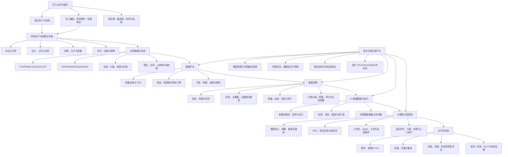

# 军工行业数据平台、数据治理与大模型交付知识地图

> 适用对象：滴普科技项目经理、售前解决方案、交付负责人
>
> 默认场景：中国大陆军工央企、科研院所及军队单位的数据与 AI 项目
>
> 资料边界：只使用公开、合规资料，不涉及涉密数据、装备参数或内部系统信息
>
> 调研日期：2026-07-27

## 使用方法：不要从头读到尾

这不是一份百科全书，而是一套“先形成判断，再进入项目”的学习与工作手册。按你的可用时间选择入口：

| 可用时间 | 阅读路径 | 学完要能做到 |
|---|---|---|
| 10 分钟 | 本节 + 第 0 节 + 第 2 节 | 用一张图讲清客户、业务、数据、平台、治理、AI、合规和验收 |
| 2 小时 | 第 3—10 节 + 第 13 节模拟项目 | 判断客户属于哪类、项目解决什么问题、滴普产品如何进入、验收证据缺什么 |
| 7 天 | 第 11 节学习计划 + 第 14 节阅读任务 + 第 16 节模板 | 能独立完成一次访谈、产品映射、PoC 设计和 15 分钟方案汇报 |
| 遇到具体项目 | 第 5—8 节 + 第 10、16 节 | 先核边界和门禁，再讨论架构、产品与排期 |

不同岗位的最短路径：

| 岗位 | 先读 | 工作中最需要掌握 |
|---|---|---|
| 项目经理 | 3.1、3.5、5、6、10、15 | 责任人、依赖、验收、风险、变更和持续运营 |
| 售前/解决方案 | 2、4、7、8、9、15 | 业务价值、架构边界、产品证据、差异化和 PoC |
| 交付负责人 | 3.4、4、5、6、15、16 | 数据清单、权限继承、部署适配、测试、恢复和移交 |

### 10 分钟核心框架：先回答八个问题

1. **客户是谁：** 军队单位还是军工企业？总部、研究所、制造厂还是保障单位？
2. **业务卡在哪里：** 论证、设计、试验、质量、生产、交付还是保障？
3. **关键对象是什么：** 型号、产品、BOM、技术状态、规范、试验、质量问题还是保障资源？
4. **数据在哪里：** PLM/PDM、ERP、MES、QMS、试验平台、档案还是文档库？
5. **边界是什么：** 涉密与否、网络域、国产化范围、导入导出、人员和运维方式？
6. **产品如何组合：** FastData 治数据和语料，Deepexi 治企业语义，FastAGI/DeepWorks 治知识、模型、智能体和流程。
7. **如何证明有效：** 用业务样本做 PoC，以引用、权限、性能、安全、恢复和业务指标共同验收。
8. **谁来持续运营：** 谁负责源数据、标准、知识发布、评测集、模型版本、智能体和问题闭环？


一句话判断项目是否靠谱：

> 如果方案说不清“谁在什么网络里，基于什么版本的数据和证据，完成什么业务任务，谁审核，出了错如何发现、拒绝、回滚和追责”，就还不是可交付方案。

## 0. 先记住的五个结论

1. **军工不是一个单一行业，而是“军队用户—军工集团—科研院所—制造单位—配套供应商—监管与测评机构”组成的复杂体系。** 同一个“数据平台”项目，在集团总部、研究所、制造厂和军队单位中的目标、数据、验收方式会明显不同。
2. **军工数据项目首先是边界和责任项目，其次才是技术项目。** 是否涉密、网络域如何划分、谁能访问、能否导入导出、谁审批、日志如何留存、故障如何恢复，会直接决定架构、实施地点、人员和交付方式。
3. **数据平台、数据治理和大模型不能拆成三套孤立工程。** 正确链路是“业务对象与流程 → 数据接入与治理 → 可追溯的数据/知识资产 → 模型或智能体 → 人在回路的业务执行 → 评测、审计与持续运营”。
4. **军工大模型的近期主战场不是训练一个更大的基础模型，而是私有部署、专业知识库、文档理解、可靠检索、受控执行和可验证验收。** 2026 年军队采购公开样本已经将国产化、离线运行、多格式解析、权限、双人审核、不可篡改日志、备份恢复和驻场运维写入具体要求。
5. **滴普科技的合理切入点是 Data + AI 一体化交付。** FastData 负责多模态数据接入、湖仓、开发治理和语料入口；Deepexi 企业大模型负责企业本体和领域理解；FastAGI/DeepWorks 负责知识、模型、智能体及业务流程执行。但“官网具备某能力”不等于“已满足军工验收”，必须补齐资质、国产化互认证、离线部署、安全审计和恢复测试等证据。

## 1. 证据分级

本文用以下等级约束结论：

| 等级 | 含义 | 使用方式 |
|---|---|---|
| A | 法律法规、现行国家标准、军队采购网、国家数据局、港交所披露 | 可作为当前事实或项目要求样本 |
| B | 厂商官网产品页、厂商公开案例 | 只能证明厂商公开宣称或披露的能力 |
| C | 根据 A/B 证据形成的项目方法和能力映射 | 属于分析结论，需要在具体项目验证 |
| D | 本次公开检索未找到充分证据的事项 | 必须向公司内部或客户确认，不能做肯定承诺 |

## 2. 总知识地图



## 3. 军工行业应该怎么理解

### 3.1 组织地图

当前国资委央企名录中，处于名单前列的相关集团包括中核集团、航天科技、航天科工、航空工业、中国船舶、兵器工业、兵器装备、中国电科和中国航发等。实际项目还可能涉及集团二级单位、研究院、研究所、工厂、专业公司、军工高校和军队单位。不能把集团总部的治理项目经验直接套到研究所或制造厂。

进入项目时，先把市场分成两条线：

| 市场线 | 典型客户 | 主要任务逻辑 | 首先确认 |
|---|---|---|---|
| 军队单位 | 机关、院校、科研试验、采购与保障等单位 | 围绕装备科研、采购、使用和保障形成需求与验收 | 采购资格、网络与保密边界、用户与保障责任、验收和运维要求 |
| 军工企业 | 集团总部、研究院所、制造厂、专业公司和配套企业 | 围绕科研、设计、工艺、制造、质量和经营管理形成数据链 | 型号/项目边界、信息化与业务权责、生产网络、供应链与已有平台 |

这两类客户可能共同出现在一个项目生态中，但合同关系、数据责任、现场规则和验收权并不相同。2025 年修订施行的《军队装备科研条例》进一步规范了装备预先研究、装备研制、综合研究，以及质量、经费、验收评价、成果、安全和保密等工作，说明“科研任务”和“软件平台项目”不能脱离项目管理与验收责任单独理解。

在两条市场线下，再按工作场景分为四类：

| 客户类型 | 第一目标 | 常见数据 | 典型难点 |
|---|---|---|---|
| 集团总部 | 穿透式管理、标准统一、共享复用 | 经营、项目、财务、供应链、质量汇总 | 多级组织、历史平台多、口径不统一 |
| 科研院所 | 科研协同、知识复用、设计与试验效率 | 图纸、规范、报告、试验记录、仿真数据 | 文档多模态、版本复杂、知识隐性化 |
| 制造单位 | 生产透明、质量追溯、交付保障 | BOM、工艺、设备、生产、检测、质量 | OT/IT 融合、实时性、批次和构型追溯 |
| 军队或保障单位 | 安全可控的信息利用和业务支撑 | 规章制度、保障资源、业务记录、知识资料 | 网络隔离、权限严格、审计和恢复要求高 |

### 3.2 典型业务链

不同装备和单位流程不同，但数据项目可以先用以下通用链路理解：

```text
需求/任务
→ 论证与立项
→ 总体与详细设计
→ 工艺设计与试制
→ 试验验证与问题归零
→ 设计/生产状态确认
→ 采购与批量生产
→ 质量检验与交付
→ 运行维护、备件与保障
→ 反馈进入下一轮设计改进
```

数据平台的价值不是把系统数据搬到一起，而是让“需求—设计—工艺—制造—试验—质量—交付—保障”的关键对象可以关联、追溯和复用。

### 3.3 必须熟悉的业务对象

- 型号/项目、任务、合同、计划、里程碑。
- 产品、部组件、零件、构型、BOM、版本和技术状态。
- 图纸、模型、规范、工艺路线、工序、程序和作业指导。
- 设备、工装、刀具、材料、批次、供应商和质量证明。
- 试验任务、条件、过程数据、结果、结论和问题单。
- 缺陷、不合格项、故障、原因、措施、验证与关闭。
- 人员、岗位、组织、权限、密级、知识范围和操作记录。

### 3.4 常见源系统与数据

| 域 | 常见系统 | 主要数据形态 |
|---|---|---|
| 研发设计 | PLM/PDM、CAD/CAE、需求管理、仿真平台 | 图纸、三维模型、BOM、设计文件、仿真结果 |
| 工艺制造 | CAPP、MES、DNC、SCADA/设备采集 | 工艺路线、程序、工单、参数、时序数据 |
| 质量试验 | QMS、LIMS、试验管理、计量管理 | 检验结果、曲线、图像、报告、问题闭环 |
| 经营供应链 | ERP、SRM、SCM、合同与项目管理 | 物料、采购、库存、供应商、计划、成本 |
| 运维保障 | EAM、维修保障、备件管理、IETM | 状态、故障、维修记录、手册、备件 |
| 知识档案 | 档案、文档、标准规范、邮件/协同 | PDF、Word、扫描件、表格、图片、音视频 |

### 3.5 项目角色与影响力地图

下表是公开信息和政企项目经验归纳出的**典型角色模型**，不是所有单位的固定组织设置。正式项目必须以客户组织、采购文件和访谈结果为准。

| 典型角色 | 通常决定或控制什么 | 最关心什么 | 项目经理必须问 | 对项目的门禁/验收影响 |
|---|---|---|---|---|
| 项目发起/主管部门 | 立项目标、范围、预算和优先级 | 业务成效、进度、风险和可持续性 | 不做会损失什么？首期必须改变哪个指标？ | 决定项目是否值得做、范围是否失控 |
| 业务部门/一线用户 | 业务规则、样本、使用和效果反馈 | 是否解决真实任务、是否增加额外负担 | 当前流程、例外、痛点、责任和成功样本是什么？ | 决定需求真实性与业务验收 |
| 信息化/数据中心 | 架构、接口、网络、平台和技术运维 | 集成、稳定、性能、可维护和复用 | 现有平台、接口政策、资源、运维责任和技术标准是什么？ | 决定技术路线、接入和上线 |
| 保密/网安部门 | 保密边界、人员场所、介质、导入导出和审计要求 | 不越界、可审计、可追责 | 项目和数据如何定密？哪些行为需审批？供应商可接触什么？ | 不满足时可阻止进场、数据使用或上线 |
| 质量/科研管理 | 质量体系、过程证据、问题闭环和阶段评审 | 过程受控、证据完整、问题可归零 | 哪些基线、评审点、问题单和质量记录必须纳入？ | 影响阶段评审与质量验收 |
| 档案/标准化/知识管理 | 文件归档、版本、有效性、发布和借阅 | 版本唯一、来源可查、失效可控 | 哪个版本有效？谁可发布、变更、下架和销毁？ | 决定知识库能否成为可信依据 |
| 采购/财务/审计 | 采购程序、预算、合同、付款和合规 | 条款可量化、证据可核验、费用可控 | 付款节点对应什么交付物和测试证据？ | 决定供应商准入、合同和付款 |
| 运维/保障团队 | 账号、监控、备份、恢复、升级和故障处理 | 能接得住、出问题能恢复 | RTO/RPO、SLA、备件、升级、离线补丁和移交要求是什么？ | 决定能否长期运行和最终移交 |
| 总包/集成商/产品商 | 总体集成、产品能力、接口和实施责任 | 责任边界、依赖、计划、成本和变更 | 谁负责数据、接口、适配、测试、资质与缺陷关闭？ | 决定责任是否清楚、问题是否互相推诿 |

项目经理的实用动作：首次访谈不要只列“参会人”，要输出一张 RACI 或责任矩阵，并明确每个关键交付物的提出者、确认者、审批者、执行者和维护者。

### 3.6 核心术语：先会用，再追求完整

以下是便于工作沟通的**操作性定义**；具体型号、单位和质量体系中的正式含义，以客户制度和适用标准为准。

#### 军工科研生产术语

| 术语 | 工作中先这样理解 | 容易犯的错 |
|---|---|---|
| 预研 | 为未来装备或关键技术做探索、验证和技术储备 | 把预研成果直接当成可定型、可生产产品 |
| 研制 | 从任务要求进入设计、试制、试验、评审和确认的工程过程 | 只看文档交付，不看基线、评审和问题闭环 |
| 型号/项目 | 组织任务、计划、成本、数据、质量和责任的核心管理对象 | 把同名产品、不同批次/阶段的数据混在一起 |
| 技术状态/构型 | 某一时点经确认的产品技术特征、组成和版本基线 | 只存“最新版本”，丢失历史状态和变更依据 |
| BOM | 产品组成关系；常见有设计、制造和保障等不同视角 | 认为只有一棵 BOM，忽略视图转换和版本 |
| 试验验证 | 在规定对象、条件和方法下获取证据并形成结论 | 只收最终报告，不关联条件、原始数据和问题 |
| 质量问题归零 | 对问题原因、机理、措施和验证形成可追溯闭环 | 将“关闭工单”等同于问题真正不再复发 |
| 批次/序列号 | 追踪材料、零件、产品、检验和使用状态的重要标识 | 聚合统计后无法回溯到具体实物 |
| 六性 | 工程中常见的可靠性、维修性、保障性、测试性、安全性、环境适应性等要求集合 | 未确认客户采用的范围和口径就直接套模板 |
| 军代表/用户代表 | 在相应职责范围内参与合同履行、质量监督或验收的用户方角色 | 未核实授权边界就假定其可替代所有业务确认 |

#### 数据与 AI 术语

| 术语 | 工作中先这样理解 | 必须交付的证据 |
|---|---|---|
| 数据域 | 按相对稳定的业务对象和责任划分数据范围 | 域边界、责任人、对象和系统映射 |
| 主数据 | 跨流程反复使用、需要统一标识和口径的核心对象 | 标准、编码、黄金记录、分发和变更流程 |
| 元数据/血缘 | 数据是什么、来自哪里、如何加工、被谁使用 | 技术与业务元数据、端到端链路和影响分析 |
| 数据质量 | 数据满足特定业务使用要求的程度 | 规则、基线、问题单、责任人、整改与复核 |
| 分类分级 | 依据数据属性、重要程度和影响确定管理与保护策略 | 目录、级别、依据、权限和处置策略 |
| 高质量数据集 | 为特定模型/任务经过授权、治理、标注和评测的数据集合 | 来源、版本、质量、授权、切分和评测记录 |
| RAG | 先检索授权知识，再让模型基于证据生成答案 | 检索结果、引用定位、无证据拒答和评测集 |
| 本体/语义层 | 用统一对象、关系、属性和规则表达企业业务语义 | 概念模型、映射规则、版本和业务确认 |
| Rerank | 对初次检索结果再次排序，提高相关证据靠前概率 | 对照测试、召回与排序指标 |
| Agent/智能体 | 在权限和流程约束下使用模型、知识与工具完成任务 | 工具白名单、审批点、日志、失败和回滚策略 |
| 人在回路 | 关键判断或动作由授权人员确认、纠正或接管 | 触发条件、审批角色、超时与升级路径 |
| 模型评测 | 用固定样本和指标检验正确性、安全性、稳定性及变化 | 数据集版本、环境、结果、失败样本和回归记录 |

## 4. 三类项目的端到端链路

### 4.1 数据平台建设

```text
业务目标
→ 数据源盘点
→ 网络与部署边界
→ 数据接入/交换
→ 湖仓和多模型存储
→ 数据开发、调度和运维
→ 数据服务/API/指标
→ 安全、容灾和运营
```

核心交付物：

- 现状调研和数据源清单。
- 总体架构、网络部署和数据流转图。
- 数据接入规范、接口清单和同步策略。
- 分层模型、主题域和公共数据模型。
- 开发调度、服务目录、监控告警和运维方案。
- 容量、性能、备份恢复及扩展性测试报告。

### 4.2 数据治理专项

```text
治理目标与范围
→ 组织和责任
→ 业务对象与数据域
→ 标准/主数据/元数据
→ 质量规则和问题闭环
→ 目录、血缘和资产服务
→ 分类分级与权限
→ 指标运营和成熟度改进
```

最容易失败的原因不是工具缺功能，而是：

- 没有业务责任人，所有责任落在信息化部门。
- 只建目录，不建立问题发现、派单、整改、复核和关闭机制。
- 标准停留在 Excel，不进入数据开发、接口和质量规则。
- 一次性盘点后不维护，资产目录和真实系统逐渐脱节。
- 只治理结构化表，忽略图纸、试验报告、标准规范等关键非结构化资产。

### 4.3 大模型/智能体交付

```text
业务任务与风险等级
→ 网络、数据和模型边界
→ 数据/知识盘点与授权
→ 解析、清洗、切分、标签和版本
→ RAG/图谱/本体/微调路线选择
→ 模型服务、知识库、工作流和工具
→ 权限、引用、拒答、审核和审计
→ 离线评测、红队测试、试运行
→ 上线、监控、反馈和持续优化
```

优先级建议：

1. 先做专业知识检索与问答；
2. 再做文档审查、信息抽取和对比；
3. 再做数据查询、分析和报告生成；
4. 最后才让 Agent 调用业务系统执行动作。

动作风险越高，越需要审批、最小权限、可回滚和完整审计。

## 5. 安全合规：必须区分的两条线

### 5.1 涉密线

《保守国家秘密法》于 2024 年修订并自 2024 年 5 月 1 日起施行；修订后的实施条例自 2024 年 9 月 1 日起施行。涉密信息系统的规划、设计、建设、监理和运行维护属于涉密集成活动；承接单位应按业务范围取得相应资质。

项目经理必须先问：

- 项目、系统、数据、场所和人员是否涉密，最高密级是什么？
- 哪些网络域可以互联，哪些必须隔离？
- 供应商以总包、分包、产品提供还是现场服务身份参与？
- 实施人员、开发环境、介质、远程支持和日志导出如何管理？
- 软件升级、模型更新、漏洞修复和备份介质如何进入现场？

**重要边界：** 等保三级、ISO 27001、CMMI 或普通安全认证不能替代涉密信息系统集成资质，也不能自动证明系统满足具体涉密项目要求。

### 5.2 非涉密网络与数据安全线

至少关注：

- 2025 年修正、当前有效的《网络安全法》。
- 《数据安全法》与 2025 年 1 月 1 日施行的《网络数据安全管理条例》。
- 《关键信息基础设施安全保护条例》；国防科技工业被明确列入可能涉及关键信息基础设施的重要行业领域。
- GB/T 22239-2019《网络安全等级保护基本要求》，2025 年复审结论为继续有效。
- GB/T 43697-2024《数据安全技术 数据分类分级规则》。
- 密码应用、个人信息和供应链安全方面的适用要求。

不能把“军工单位”直接等同于“所有系统都是关基”或“所有系统都必须物理隔离”。是否属于关基、是否涉密、采用什么隔离方式，需要由主管部门、客户和项目边界共同确定。

### 5.3 生成式 AI 合规线

《生成式人工智能服务管理暂行办法》主要适用于向境内公众提供生成式 AI 服务。企业或科研机构研发、应用生成式 AI，未向境内公众提供服务的，不直接适用该办法的公众服务监管范围；但数据安全、保密、知识产权、个人信息、网络安全和行业管理要求仍然适用。

工程上仍建议参照：

- GB/T 45654-2025《网络安全技术 生成式人工智能服务安全基本要求》。
- GB/T 45652-2025《网络安全技术 生成式人工智能预训练和优化训练数据安全规范》。
- 训练/知识语料来源、授权、版本和使用范围记录。
- 提示注入、越权检索、敏感信息泄露、模型幻觉和工具误调用测试。
- 模型、语料、向量索引、配置、工作流和日志的备份恢复。

## 6. 公开采购样本透露出的真实验收方向

### 6.1 2025 年数据资源治理项目

军队采购网公开的“数据资源治理应用建设”将采购拆为三块：数据资源治理平台、治理实施服务和驻场运维服务，公开金额约为 130 万、117 万和 57 万元。这说明客户购买的不是单一工具，而是“产品 + 治理实施 + 长期运营”。

### 6.2 2026 年私有大模型项目

某单位 DeepSeek 私有化部署公开需求包括：

- 物理隔离、安全可控、本地智能分析。
- PDF/扫描件、Word、Excel、PPT、TXT 等文档接入和国产 OCR。
- 五类角色以及功能、数据权限。
- 数据录入“提交—审核”双人认证。
- 关键操作全流程日志且要求不可篡改。
- 冷热数据、五年日志、独立备份系统、恢复演示。
- 全栈国产软硬件、兼容认证、驻场和五年质保。
- 问答平均响应时间、并发数和容量预留等量化指标。

另一项 2026 年大模型服务平台采购意向进一步要求国产算力、三款以上模型、模型管理、智能数据处理、知识库、工作流、多模态解析、向量检索和重排序，并给出吞吐、显存、并发和存储指标。

由此得到一个实用验收框架：

| 维度 | 必须形成的证据 |
|---|---|
| 功能 | 用例、结果截图、接口和业务流程闭环 |
| 数据 | 来源、标准、质量、授权、版本、血缘和更新 |
| 模型 | 版本、精度、引用、拒答、幻觉和安全评测 |
| 性能 | 并发、时延、吞吐、容量和稳定性报告 |
| 安全 | 角色权限、审批、日志、导入导出和攻击测试 |
| 国产化 | 软硬件清单、适配记录、互认证和现场验证 |
| 可靠性 | 备份、恢复、RTO/RPO、故障演练和回滚 |
| 服务 | 培训、驻场、SLA、升级机制和问题闭环 |

## 7. 滴普科技产品放到知识地图中的位置

### 7.1 已由公开资料支持的能力

| 产品/能力 | 在军工项目中的候选位置 | 公开证据边界 |
|---|---|---|
| FastData / FastData Foil | 多源接入、CDC、实时湖仓、多模态解析、数据开发治理、目录和质量、AI 语料入口 | 官网明确列出 Iceberg、Flink、Spark、Graph、Vector、Unity Catalog 以及结构化/半结构化/非结构化治理 |
| Deepexi 企业大模型 | 企业本体、业务语义、领域理解、SQL/Python 和受控业务操作 | 官网和 2025 年报披露本体范式、业务知识数据集及 Agent 执行能力 |
| FastAGI | 知识库、模型管理、智能体构建、流程编排、权限和效果评估 | 2025 年报及 2025 年公开产品材料 |
| DeepWorks | 本地工作台、云端智能中枢、知识/工具/流程连接、专家团、人工闸门和可审计执行 | 2026 年当前官网 |
| FDESense / FDE Sense | 源系统字段梳理、主口径、映射、本体建造及数据治理交付辅助 | 2026 年当前官网 |
| DeepSense | 设计、BOM、工艺、设备运维等工业智能体场景 | 2026 年当前官网及年报 |

港交所 2025 年报显示，FastData 收入约 1.605 亿元，FastAGI 收入约 2.545 亿元；FastAGI 占总收入 61.3%。这说明公司已经从以数据平台为主，转向 Data + AI 双产品体系，且 AI 业务成为更主要的收入来源。

### 7.2 一个最接近军工科研场景的公开案例

滴普科技与上海船舶研究设计院的公开案例使用 DeepexiOS、DeepexiGenAI 和 FastAGI，建设船舶法规及入级规范智能体；对中英文研发设计资料和国际法规进行切片与语料处理，形成双语知识库，并使用 embedding、rerank 和意图识别支持设计规范检索。

这个案例能够证明滴普在以下方向有公开实践：

- 工程设计专业文档。
- 中英文标准规范。
- 多规则切片和语料预处理。
- 领域检索、重排和智能体。
- 与设计流程结合的知识应用。

但它**不能单独证明**滴普已经完成涉密军工项目、拥有某项军工资质，或满足某个军工单位的全栈国产化和安全验收。

### 7.3 进入军工项目最需要补证的清单

以下不是判断滴普“没有”，而是本次公开资料不足，需要内部确认：

1. FastAGI、DeepWorks 与 DeepexiOS 当前正式产品关系、版本和报价口径。
2. 完全离线、物理隔离环境下是否存在外部许可、遥测、升级或依赖。
3. 国产 CPU、GPU/NPU、操作系统、数据库、中间件、OCR、向量库的兼容矩阵和互认证材料。
4. 是否具备或通过合作伙伴覆盖涉密信息系统集成所需资质范围。
5. 数据、文档、知识库、分段、向量索引和 Agent 工具的细粒度权限是否继承源系统权限。
6. 双人审核、导入导出审批、日志防篡改、介质管理和离线补丁机制。
7. 备份范围是否覆盖模型、语料、索引、配置、工作流和智能体；RTO/RPO 是否经过恢复演示。
8. 国产算力上的并发、时延、吞吐、长上下文和批量解析基准。
9. 回答引用、证据定位、拒答、越权检索、提示注入和工具误调用的评测报告。
10. SBOM、第三方组件许可证、漏洞响应、版本回滚和长期支持策略。

## 8. 同类产品对照

这不是厂商排名，而是用于理解竞争形态的公开资料对照。具体项目必须以当期版本、报价、PoC 和证明文件为准。

| 厂商/组合 | 数据底座 | 治理 | AI/智能体 | 公开定位与相对特点 | 对滴普的启示 |
|---|---|---|---|---|---|
| **滴普科技：FastData + Deepexi + FastAGI/DeepWorks** | 湖仓、CDC、多模型引擎、多模态数据 | 开发治理、目录、质量、本体 | 企业模型、知识库、Agent、Skills、执行闭环 | Data + AI 一体化，本体和 FDE 交付模式突出 | 把一体化优势转成军工可验收证据，明确新旧产品口径 |
| **星环科技：TDC/AI-Ready Data Platform + Sophon LLMOps** | 自研大数据、多模型数据库、容器数据云 | 全链治理、知识构建 | 语料、知识、训练、模型管理、应用编排 | 数据基础设施和多模型存储能力强，强调私有数据云 | 滴普需要证明底层性能、规模、复杂负载和国产化部署能力 |
| **华为：DataArts + ModelArts/盘古 + 华为云 Stack** | 云、存算、数据治理生产线 | DataArts 全生命周期治理 | 数据工程、模型训练部署、Agent、行业模型 | 芯片—云—数据—模型全栈和生态适配能力强 | 滴普应突出更轻量、场景更快、交付更聚焦，同时建立生态适配 |
| **亚信科技：DataAtlas/DataOS + TAC MaaS + Ontology + Agent** | 多模态存储、虚拟化、DataOps | 主动元数据、质量、安全、资产 | 模型全生命周期、本体、智能体和治理副驾 | 产品覆盖面与滴普高度相近，官网明确 50+ 信创互认证 | 应重点比较本体落地、Agent 治理、交付效率和工业/军工场景 |
| **数澜科技：数据平台 + 大模型平台 + 智能体 + 超级云** | 数据中台、混合云、40+ 数据源 | 数据标准、质量和资产 | 数据准备、知识工程、训推、Agent 和人工介入 | 同样强调数据到 AI 全链路，平台轻量与政企经验是竞争点 | 应通过复杂工业数据、实时湖仓和 FDE 方法形成差异 |
| **普元信息：数据资产/主数据/治理 + iPaaS/低代码** | 集成与服务平台 | 元数据、标准、质量、主数据、资产和 API | AI 主要作为治理后数据的消费与增强 | 治理方法、主数据和央国企客户基础突出 | 治理专项中不能只讲湖仓和 Agent，要补强制度、主数据及运营方法 |

### 8.1 滴普的建议竞争叙事

不要只说“我们有数据中台和大模型”。更有效的叙事是：

> 滴普用 FastData 将结构化数据、工程文档、图纸、表格和历史知识统一接入、治理并形成可追溯的数据与语料资产；用 Deepexi 企业大模型和企业本体理解客户独有的对象、关系、规则与流程；再通过 FastAGI/DeepWorks 把知识问答、数据分析和业务动作装配成有权限、有依据、有人审、可回滚、可审计的智能体。项目按客户网络和保密边界私有部署，并用国产化适配、性能、安全、备份恢复和业务指标共同验收。

这段话中最后一句只有在内部能力和项目证据确认后才能写入正式投标承诺。

### 8.2 竞品比较必须转成同场 PoC

官网材料只能说明厂商公开定位，不能据此判断谁更适合具体项目。正式比较采用“两层机制”：

#### 第一层：一票否决门禁

任何一项失败，都不能用其他高分抵消。是否必须通过以及具体阈值，由采购文件和客户确认。

| 门禁项 | 统一测试方法 | 通过证据 |
|---|---|---|
| 离线/隔离部署 | 断开所有外部网络后完成安装、启动、许可校验、核心业务和重启 | 网络抓包、部署记录、许可说明、现场录像/见证 |
| 权限隔离 | 用不同角色、部门和数据权限执行同一查询，并尝试直接访问底层对象 | 正向/越权用例、权限配置、审计日志 |
| 引用与拒答 | 提问有证据、无证据、证据冲突、失效版本和越权内容 | 引用到页/段/版本；无依据或越权时按规则拒答 |
| 审批与操作审计 | 发起知识发布、导出、Agent 高风险动作和回滚 | 审批链、操作者、时间、输入输出、结果和防篡改说明 |
| 国产化适配 | 在目标 CPU/GPU/NPU、OS、数据库、中间件上安装和运行规定用例 | 版本清单、兼容证明、安装记录和现场结果 |
| 备份恢复 | 备份数据、语料、索引、模型、配置和工作流；模拟故障后恢复 | 恢复演示、完整性校验、RTO/RPO 结果 |
| 供应链与运维 | 检查 SBOM、第三方许可、漏洞修复、补丁进入现场和长期支持 | SBOM、许可证、漏洞响应和服务承诺 |

#### 第二层：100 分能力评分

| 维度 | 权重 | 不看宣传，现场看什么 |
|---|---:|---|
| 边界、部署与安全 | 20 | 离线性、权限、审批、日志、导入导出、密钥与介质管理 |
| 数据平台与治理 | 20 | 接入、增量、湖仓、多模态、标准、主数据、质量、血缘和目录闭环 |
| 知识与大模型 | 20 | 解析、切分、检索、重排、引用、拒答、评测、模型管理和更新 |
| Agent 与动作治理 | 15 | 工具白名单、最小权限、人工闸门、幂等、超时、失败和回滚 |
| 性能与可靠性 | 15 | 并发、时延、吞吐、稳定性、扩容、备份、恢复和故障演练 |
| 交付、服务与证据 | 10 | 实施方法、人员、案例、培训、SLA、缺陷闭环和证明文件 |
| **合计** | **100** | 只记录可复测结果；没有证据记“未验证”，不能默认得分 |

#### 统一 PoC 用例

以“工程规范智能助手”为例，所有厂商使用同一批脱敏数据、同一硬件、同一时间窗口和同一测试集：

| 编号 | 测试任务 | 测量指标 | 证据 |
|---|---|---|---|
| P01 | 接入 PDF、扫描件、Word、Excel、中英文规范和版本关系 | 成功率、解析准确性、失败处理 | 原文件、解析结果、失败清单 |
| P02 | 识别文件编号、版本、有效期、条款、表格和图像说明 | 字段准确率、可纠正性 | 标注集、系统结果、差异报告 |
| P03 | 对已授权问题检索并回答 | Top-K 召回、答案正确性、引用准确性 | 固定评测集和逐题结果 |
| P04 | 处理无证据、冲突、失效和越权问题 | 正确拒答/升级率、泄露数 | 风险样本、日志和结果 |
| P05 | 发布新版、下架旧版并执行增量更新 | 更新时间、版本命中正确率、回滚能力 | 前后对照、索引和版本记录 |
| P06 | 多角色、并发和长时间稳定运行 | P95 时延、吞吐、错误率、资源使用 | 压测脚本、环境、原始结果 |
| P07 | 知识发布与高风险 Agent 动作走人工审核 | 未审批执行数、审计完整性、回滚结果 | 审批单、操作日志、恢复结果 |
| P08 | 故障后恢复整个服务 | 实际 RTO/RPO、数据与配置完整性 | 备份、故障注入和恢复报告 |

PoC 比较表必须保留空白，避免先入为主：

| 维度 | 权重 | 滴普 | 厂商 A | 厂商 B | 厂商 C | 证据编号/备注 |
|---|---:|---:|---:|---:|---:|---|
| 门禁是否全部通过 | — | 待测 | 待测 | 待测 | 待测 | 任一必选门禁失败即不进入总分 |
| 边界、部署与安全 | 20 |  |  |  |  |  |
| 数据平台与治理 | 20 |  |  |  |  |  |
| 知识与大模型 | 20 |  |  |  |  |  |
| Agent 与动作治理 | 15 |  |  |  |  |  |
| 性能与可靠性 | 15 |  |  |  |  |  |
| 交付、服务与证据 | 10 |  |  |  |  |  |
| **合计** | **100** |  |  |  |  |  |

## 9. 军工大模型的优先场景

### 第一梯队：低动作风险、价值易验证

- 标准规范、制度、技术文档和档案的知识检索。
- 中英文规范对比、条款定位、版本差异和引用回答。
- 试验报告、质量报告、故障报告的信息抽取和关联。
- 文档分类、元数据补全、标签推荐和知识入库辅助。
- 数据平台使用、数据标准和治理规则问答。

### 第二梯队：需要业务规则和人工复核

- 设计审查辅助、规范符合性检查。
- BOM、工艺、质量问题和历史案例关联分析。
- 自然语言取数、指标解释和经营/项目分析。
- 设备故障诊断、维修知识推荐和备件核对。
- 数据质量异常原因分析与整改建议。

### 第三梯队：高风险受控执行

- 自动修改设计、工艺或主数据。
- 自动下发生产、采购或维修指令。
- 跨系统自动审批和数据导出。
- 直接用于关键决策的预测与建议。

第三梯队必须设置明确的人工闸门、授权边界、仿真或沙箱、回滚和责任链。

## 10. 项目经理的需求访谈清单

### 10.1 目标与范围

1. 当前最想缩短哪一段业务时间，或降低哪一种风险？
2. 目标用户是谁，在哪个岗位、哪个网络、什么场所使用？
3. 首期只验证一个场景，还是建设集团级平台？
4. 成功的业务指标是什么：时间、准确率、召回率、质量问题数还是人员投入？

### 10.2 安全与部署

5. 项目及数据是否涉密，最高密级和知悉范围是什么？
6. 网络域、数据域和安全域如何划分？允许哪些单向或双向交换？
7. 是否属于关基或需要等保、密评及其他专项测评？
8. 是否要求全栈国产化，指定或允许哪些软硬件品牌？
9. 是否允许远程支持、联网许可、在线升级或云端调用？

### 10.3 数据与治理

10. 首期数据源、责任部门、数据量、增量和更新频率是什么？
11. 结构化、文档、图纸、图片、音视频和时序数据分别占多少？
12. 是否已经有数据标准、主数据、目录、血缘、质量规则和分类分级？
13. 源系统权限如何传递到湖仓、知识库、向量索引和回答结果？
14. 数据问题由谁确认、整改、复核和关闭？

### 10.4 模型与知识

15. 场景适合 RAG、本体/图谱、微调还是规则引擎？为什么？
16. 回答是否必须给出处、页码、版本和原文片段？
17. 无证据、证据冲突或权限不足时，系统应如何拒答或升级？
18. 谁可以发布、更新、下架知识和智能体？是否需要双人审核？
19. 允许 Agent 调用哪些系统和工具，哪些动作必须人工确认？

### 10.5 验收与运营

20. 功能、性能、安全、国产化和业务成效分别如何验收？
21. 测试集由谁提供，是否包含困难样本、越权样本和攻击样本？
22. RTO、RPO、日志留存年限和恢复演示要求是什么？
23. 驻场人数、响应时间、升级频率和质保期如何要求？
24. 项目结束后由谁持续维护数据、知识、评测集和 Agent？

## 11. 7 天快速学习计划

每天建议投入 90—120 分钟。学习对象统一使用第 13 节“研究院工程规范智能助手”，避免每天换案例导致知识无法连接；所有产出直接填写第 16 节模板。

| 天 | 学习任务 | 使用材料/模板 | 当天必须交付 | 完成标准 |
|---|---|---|---|
| Day 1 | 识别客户、角色、业务链和瓶颈 | 第 3 节 + 模板 A | 一页客户—业务—系统地图 | 能解释研究所与制造厂的不同，并指出发起人、用户、信息化、保密、质量和运维责任 |
| Day 2 | 划定涉密、网络、人员、数据和运维边界 | 第 5、6 节 + 模板 B | 安全与部署边界检查表 | 所有未知项有责任人和确认时间；能说明涉密、等保和关基不能互相替代 |
| Day 3 | 从源系统设计数据平台链路 | 第 4.1、7 节 + 模板 C | 源系统—FastData—数据服务架构图 | 每条数据流都有来源、频率、责任、目标、失败和恢复方式 |
| Day 4 | 设计标准、版本、质量和知识发布闭环 | 第 4.2、3.6 节 + 模板 C | 一条“发现—派单—整改—复核—关闭”流程 | 能说明目录建设为何不等于治理；旧版规范如何失效 |
| Day 5 | 设计 RAG、权限、引用、拒答和 Agent 闸门 | 第 4.3、8.2、15 节 + 模板 D | 20—30 题最小评测集和 PoC 表 | 至少覆盖正确、无证据、冲突、失效、越权和攻击六类样本 |
| Day 6 | 将滴普和竞品放入同一证据体系 | 第 7、8 节 + 模板 C/D | 产品—需求—证据矩阵 | 每个能力有版本和证明；无证据明确标“待验证”，不写成承诺 |
| Day 7 | 完成一次内部售前—交付联审 | 第 13、15 节 + 模板 E | 15 分钟方案和问题清单 | 能讲清目标、边界、架构、实施、验收、风险；在 5 分钟追问中不靠猜测作答 |

学习时只遵守三条纪律：

1. 每天先读 30—40 分钟，再用 50—70 分钟做交付物；不以“看完资料”为完成。
2. 事实、客户待确认、厂商公开宣称和方案建议分栏记录，不能混写。
3. 第二天先用 10 分钟复述前一天产出；讲不清的部分才是下一轮学习重点。

## 12. 30 天进阶路线

### 第 1 周：建立行业语言

- 完成 7 天学习计划。
- 熟悉 20 个核心业务对象和 10 类源系统。
- 能画出集团、研究所、制造厂三种客户的差异地图。

### 第 2 周：形成方案能力

- 各完成一份数据平台、治理专项和大模型项目蓝图。
- 为每份蓝图补充网络、安全、国产化、备份和运维章节。
- 用公开采购参数反推功能、性能和验收清单。

### 第 3 周：完成滴普产品化映射

- 获取公司内部正式产品架构、版本、兼容矩阵和案例材料。
- 完成一份“能力—版本—证明文件—负责人”台账。
- 选择星环、华为、亚信和数澜做一次真实 PoC 维度对照。

### 第 4 周：完成一次模拟交付

- 选一个低风险场景，例如“工程规范智能检索”。
- 形成需求说明、数据清单、架构、实施计划、评测集和验收报告模板。
- 组织一次内部评审，让安全、产品、交付和业务四类角色分别挑战方案。

## 13. 完整模拟项目：研究院工程规范智能助手

这是一个用于学习和内部演练的虚构项目，不代表任何真实客户或滴普现有合同。数据量、指标和周期均为示例，正式项目必须重新确认。

### 13.1 为什么选这个场景

研究人员在设计和审查时，需要查找大量中英文标准、企业规范、历史报告和条款。常见问题是检索慢、同名多版本、扫描件难查、旧版误用、知识依赖少数专家。这个场景动作风险低、价值可度量，又能覆盖多模态数据、治理、RAG、权限、国产化、评测和运营，适合作为军工 Data + AI 入门项目。

**首期不做：** 自动修改设计文件、自动形成审查结论、自动调用生产系统、处理未经批准的数据。助手只提供带依据的检索、对比和辅助提示，最终判断由授权人员完成。

### 13.2 假设与待确认边界

| 项目要素 | 演练假设 | 正式项目必须确认 |
|---|---|---|
| 客户 | 某军工研究院设计部门 | 合同主体、主管部门、用户和验收组织 |
| 网络 | 客户内部隔离网络，禁止外部云调用 | 是否涉密、网络域、跨域交换和远程支持 |
| 数据 | 500—1000 份已脱敏、获授权的规范和报告 | 密级、知悉范围、版权、有效版本和销毁要求 |
| 用户 | 设计师、审查员、知识管理员、运维员、审计员 | 实际岗位、角色冲突和权限继承规则 |
| 基础设施 | 国产化服务器、OS、数据库与推理资源 | 品牌版本、兼容认证、资源配额和容量 |
| 首期目标 | 缩短检索时间，减少旧版误用，回答可引用 | 当前基线、目标值、统计方法和观察周期 |

不确定项目是否涉密时，不能先按普通内网方案实施再补手续；应暂停数据进入和现场操作，由客户有权部门确认。

### 13.3 从业务问题到产品组合


| 层次 | 关键设计 | 候选滴普产品位置 | 当前证据状态 |
|---|---|---|---|
| 数据接入 | 文档库/档案接口、批量文件、增量变更、失败重试 | FastData | 官网能力 B；具体接口和隔离环境待 PoC |
| 多模态处理 | OCR、表格、章节、页码、条款、图片说明和中英文 | FastData/FastData Foil + 适配组件 | 多模态治理 B；国产 OCR 和准确性待证 |
| 数据治理 | 编号、版本、状态、专业、密级、责任人、质量规则 | FastData + FDESense | 产品映射 C；客户制度和字段待确认 |
| 企业语义 | 规范—版本—条款—专业—设计对象—任务关系 | Deepexi 企业大模型/本体 | 官网能力 B；本项目模型待共创验证 |
| 知识应用 | 混合检索、重排、引用、对比、知识更新和反馈 | FastAGI/DeepWorks | 产品和船舶规范案例 B；指标待 PoC |
| 动作治理 | 发布/下架审核、导出审批、工具白名单、人工闸门 | FastAGI/DeepWorks + 客户流程系统 | 公开能力 B/C；细粒度权限和审计待证 |
| 部署运维 | 离线安装、国产化适配、监控、备份、恢复、升级 | 全栈产品 + 基础设施 | 公开证据不足 D，必须获取内部证据 |

### 13.4 最小可交付业务闭环

```text
知识管理员登记来源与授权
→ 系统解析并生成元数据、条款和质量报告
→ 责任人校正编号、版本、状态和专业标签
→ 审核人批准发布
→ 用户按权限检索、提问、对比版本
→ 系统返回答案、出处、页码、版本和原文
→ 无证据/冲突/越权时拒答或转人工
→ 用户反馈进入待处理队列
→ 新版发布后旧版失效，索引增量更新
→ 全过程留痕，可查询、回滚、备份和恢复
```

最小数据模型至少包含：

- 文档：唯一编号、名称、来源、版本、状态、发布日期、有效期、专业、责任部门、权限/密级标识。
- 内容：章节、条款、页码、文本、表格、图片说明、语言、解析版本和质量状态。
- 关系：替代/被替代、引用、适用于、关联产品/任务、相似/冲突。
- 运营：发布、变更、下架、查询、引用、反馈、审批、模型/索引版本和操作日志。

### 13.5 实施阶段与可验收交付物

| 阶段 | 核心动作 | 交付物 | 通过条件 |
|---|---|---|---|
| 0. 立项与边界 | 定义目标、责任、数据/网络/资质边界和禁止事项 | 项目章程、责任矩阵、边界确认单 | 客户有权角色书面确认，未知项不进入实施 |
| 1. 现状与基线 | 采集当前检索时间、错误类型、数据清单和系统现状 | 现状报告、基线、数据与接口清单 | 样本、统计口径和责任人可追溯 |
| 2. PoC 设计 | 固定数据、环境、用例、指标、厂商和证据格式 | PoC 方案、评测集、门禁与评分表 | 所有厂商同条件，失败判定清楚 |
| 3. 数据与治理 | 接入、解析、元数据、版本、质量和发布流程 | 数据模型、规则、质量报告、治理流程 | 样本可追溯，失败可发现，旧版可管控 |
| 4. 知识与应用 | 建索引、本体/RAG、引用、拒答、反馈和工作流 | 知识库、助手、配置和使用说明 | 固定评测集达到双方确认阈值 |
| 5. 安全与适配 | 权限、审计、攻击测试、国产化、离线和介质流程 | 安全测试、适配清单、问题闭环 | 必选门禁全部通过 |
| 6. 性能与恢复 | 压测、故障注入、全量备份和恢复 | 性能、稳定性、备份恢复报告 | 达到约定 P95、并发、RTO/RPO |
| 7. 试运行与验收 | 培训、真实任务试用、缺陷修复和业务效果复测 | 试运行、培训、验收和遗留项清单 | 技术与业务验收均有证据 |
| 8. 移交与运营 | 账号、监控、备份、升级、知识和评测集维护 | 运维手册、SLA、资产清单和运营看板 | 客户团队可独立完成规定操作与恢复 |

### 13.6 示例验收指标

以下只提供定义方法，不替客户预设承诺值：

| 指标 | 定义示例 | 目标值如何确定 |
|---|---|---|
| 检索成功率 | 能在规定时间内找到正确有效版本的任务数 / 总任务数 | 先测人工基线，再由业务方设改善目标 |
| 引用准确率 | 回答引用真正支持结论且版本有效的题数 / 有回答题数 | 用业务专家标注的固定评测集确认 |
| 正确拒答率 | 无证据、越权或冲突样本被正确拒答/升级的数量 / 风险样本数 | 高风险样本原则上应接近零容忍，阈值由安全方确认 |
| 越权泄露数 | 未授权用户获得受限内容的次数 | 必选门禁，通常要求为 0 |
| P95 响应时间 | 95% 请求完成时间不超过该值 | 按目标并发、硬件和问题长度实测 |
| 版本更新时效 | 批准发布到新版本可检索的时间 | 根据业务更新频率和运维窗口确定 |
| RTO/RPO | 故障恢复时间 / 可容忍的数据回退点 | 由业务连续性要求决定并现场演示 |
| 业务节省时间 | 相同任务使用前后耗时差 | 同任务、同人员范围、同统计周期对照 |

### 13.7 项目经理最容易漏掉的风险

1. 业务部门只提供“好问题”，没有失效、冲突、越权和无答案样本，导致评测虚高。
2. 源系统文档更新后，知识库没有责任人和 SLA，几个月后答案就过期。
3. 只备份数据库，不备份对象存储、向量索引、模型、配置、提示词和工作流。
4. 助手权限没有继承源系统权限，统一入库后反而扩大知悉范围。
5. OCR 或切分错误没有质量抽检，答案“有引用”但引用内容已解析错。
6. 将 PoC 最优参数直接当生产配置，没有测并发、容量、故障和长期运行。
7. 产品能力、集成商责任和客户基础设施责任没有写进合同边界。

## 14. 带任务的阅读清单

不要以“读完”为目标。每份材料都要回答一个项目问题，并生成一项可复用输出：

| 顺序 | 材料 | 建议时间 | 只回答这个问题 | 必须形成的输出 |
|---|---|---:|---|---|
| 1 | 保密法、实施条例、涉密集成资质办法 | 60 分钟 | 项目、系统、人员、场所、介质和供应商分别可能受什么边界约束？ | 模板 B 初稿；列出不能由售前自行判断的事项 |
| 2 | 军队装备科研条例公开说明 | 20 分钟 | 科研项目除了功能外，为何还要管理质量、经费、验收、安全和保密证据？ | 在项目阶段表中标出责任人与评审点 |
| 3 | 一份数据治理采购 + 一份私有大模型采购 | 45 分钟 | 客户实际把哪些产品、服务、性能、安全和运维内容写进采购？ | 提取 20 条可测试要求并归入模板 D |
| 4 | GB/T 44109 + DCMM | 60 分钟 | 治理为什么是组织、制度、流程和工具共同作用，而非建目录？ | 画一条质量问题闭环和治理责任矩阵 |
| 5 | 数据分类分级 + 高质量数据集指引 | 45 分钟 | 什么数据可以进入哪个模型/知识库，如何证明来源、质量和授权？ | 一份数据清单字段和准入/退出规则 |
| 6 | 生成式 AI 安全要求 | 45 分钟 | 要用什么样本测试泄露、幻觉、注入、越权和不当执行？ | 至少 20 条风险评测样本 |
| 7 | 滴普产品页、年报和船舶规范案例 | 60 分钟 | 哪些是已公开证明，哪些是产品映射，哪些必须内部补证？ | 模板 C 产品—需求—证据矩阵 |
| 8 | 竞品官网 + 同场 PoC 表 | 60 分钟 | 相同场景下如何用结果比较，而不是用功能名称比较？ | 模板 D，保留厂商空分和证据编号 |

推荐做法：每读完一项只写三栏笔记——“原文事实/证据”“对项目的含义”“仍需向谁验证”。没有输出的阅读不计入 7 天计划。

### 14.1 第一优先级：边界与方法

1. [《中华人民共和国保守国家秘密法（2024 修订）》](https://gdca.miit.gov.cn/zwgk/zcwj/flfg/art/2024/art_4870c40a6f8249389684d03786d41639.html)（A）
2. [《中华人民共和国保守国家秘密法实施条例》](https://www.ssf.gov.cn/portal/rootfiles/2024/08/23/1726098035285451-1726098035293140.pdf)（A）
3. [《涉密信息系统集成资质管理办法》](https://www.gjbmj.gov.cn/n1/2025/1212/c461457-40623276.html)（A）
4. [GB/T 36073-2025《数据管理能力成熟度评估模型》](https://openstd.samr.gov.cn/bzgk/std/newGbInfo?hcno=22559F9C7BF9EAC6A3927223FE33CE20)（A；2026-07-01 已替代 2018 版）
5. [GB/T 44109-2024《信息技术 大数据 数据治理实施指南》](https://std.samr.gov.cn/gb/search/gbDetailed?id=19B8508AEDE64286E06397BE0A0A616D)（A）
6. [GB/T 43697-2024《数据安全技术 数据分类分级规则》](https://openstd.samr.gov.cn/bzgk/std/newGbInfo?hcno=F0C385EDC38CBF277AEC021F23126ADE)（A）
7. [GB/T 45654-2025《网络安全技术 生成式人工智能服务安全基本要求》](https://www.tc260.org.cn/portal/article/1/20250630122232)（A）
8. [《高质量数据集建设指引》](https://www.nda.gov.cn/sjj/swdt/xwfb/0830/ff808081-96b466bd-0198-fb102e73-1690.pdf)（A）
9. [新修订的《军队装备科研条例》施行公开说明](https://www.mod.gov.cn/gfbw/gc/xjp/2025_250251/16367753.html)（A）

### 14.2 第二优先级：理解真实采购

1. [数据资源治理应用建设招标公告](https://www.plap.mil.cn/freecms/site/juncai/ggxx/info/2025/8a1d0011956a9ba40195b27fedfc0c93.html)（A）
2. [某单位 DeepSeek 私有化部署采购意向](https://www.plap.mil.cn/freecms/site/juncai/ggxx/info/2026/8a1d03d39be8962f019c2cc87db26c20.html)（A）
3. [大模型服务平台建设采购意向](https://www.plap.mil.cn/freecms/site/juncai/ggxx/info/2026/8a1d04a39d897f6e019e0c37726f39b4.html)（A）
4. [某大模型升级征求意见公告](https://www.plap.mil.cn/freecms/site/juncai/ggxx/info/2026/8a1d00679dfb499c019dfc4fb450219d.html)（A）
5. [辽宁材料实验室科研大数据平台招标公告](https://www.ccgp.gov.cn/cggg/dfgg/gkzb/202505/t20250506_24540990.htm)（A；非军工，但科研数据链路非常有参考价值）

### 14.3 第三优先级：滴普产品与案例

1. [FastData 产品页](https://www.deepexi.com/product/fastdata)（B）
2. [FastData Foil 产品页](https://www.deepexi.com/product/fastdata-foil)（B）
3. [Deepexi 企业大模型产品页](https://www.deepexi.com/product/deepexi)（B）
4. [DeepWorks 官网](https://deepworks.deepexi.com/)（B）
5. [滴普科技 2025 年度报告](https://www.hkexnews.hk/listedco/listconews/sehk/2026/0408/2026040802741_c.pdf)（A；公司法定披露）
6. [上海船舶研究设计院智能设计助手案例](https://deepexi.com/news-detail/86)（B）

### 14.4 第四优先级：竞品官方材料

1. [星环 AI-Ready Data Platform](https://www.transwarp.cn/product/ai-ready-data-platform)（B）
2. [星环 TDC 数据云](https://www.transwarp.cn/product/tdc/)（B）
3. [华为 DataArts 与 ModelArts 数智融合介绍](https://www.huawei.com/cn/publications/huaweitech/202301)（B）
4. [华为云 Stack 盘古大模型使用指南](https://support.huawei.com/enterprise/zh/doc/EDOC1100455551/5b2f47ef)（B）
5. [亚信 DataAtlas 数据基础平台](https://www.asiainfo.com/zh_cn/product_aisware_DataAtlas.html)（B）
6. [亚信 TAC MaaS 平台](https://www.asiainfo.com/zh_cn/product_aisware_AI.html)（B）
7. [数澜科技产品体系](https://www.dtwave.com/)（B）
8. [普元数据资产管理平台](https://www.primeton.com/products/zc/)（B）

## 15. 一次项目演练的推荐顺序

如果只有半天，用第 13 节案例按以下顺序演练：

1. 20 分钟：用模板 A 讲清客户、角色、业务瓶颈、系统和数据。
2. 20 分钟：用模板 B 找出必须由客户确认的边界与一票否决项。
3. 30 分钟：用模板 C 映射 FastData、Deepexi、FastAGI/DeepWorks，并把无证据项标为待验证。
4. 40 分钟：用模板 D 设计相同数据、相同环境、相同用例和相同证据格式的 PoC。
5. 30 分钟：用模板 E 做一次 15 分钟汇报，再接受 15 分钟安全、业务和交付追问。

演练的合格标准不是“方案看起来完整”，而是所有关键结论都能落入四类之一：**已验证事实、公开厂商声明、项目假设、待确认事项**。

## 16. 可直接复制使用的五套模板

### 模板 A：客户—业务—系统地图

#### A1. 一页项目定义

| 字段 | 填写 |
|---|---|
| 客户类型/组织层级 |  |
| 项目发起人/业务负责人 |  |
| 目标用户与使用场所 |  |
| 当前业务任务与流程 |  |
| 最主要瓶颈及当前基线 |  |
| 首期业务目标及统计方法 |  |
| 项目范围/明确不做 |  |
| 关键依赖和外部项目 |  |

#### A2. 角色与责任

| 角色/部门 | 关心事项 | 提供什么 | 确认/审批什么 | 维护什么 | 当前负责人 |
|---|---|---|---|---|---|
| 发起/主管 |  |  |  |  |  |
| 业务用户 |  |  |  |  |  |
| 信息化/数据中心 |  |  |  |  |  |
| 保密/网安 |  |  |  |  |  |
| 质量/档案/标准 |  |  |  |  |  |
| 采购/财务/审计 |  |  |  |  |  |
| 运维/保障 |  |  |  |  |  |

#### A3. 业务对象—系统—数据

| 业务步骤 | 核心对象 | 源系统/文件 | 数据形态与规模 | 责任部门 | 当前问题 | 目标使用 |
|---|---|---|---|---|---|---|
|  |  |  |  |  |  |  |

### 模板 B：安全与部署边界检查表

每项状态只能填“已确认/待确认/不适用”，并附确认人和证据；项目组不能替客户判断定密或关基属性。

| 类别 | 必答问题 | 状态 | 客户确认人 | 依据/证据 | 对架构或计划的影响 |
|---|---|---|---|---|---|
| 项目与数据 | 是否涉密、最高密级、知悉范围？ |  |  |  |  |
| 网络 | 有哪些网络/安全域，允许怎样交换？ |  |  |  |  |
| 场所与人员 | 供应商人员、设备、介质如何进入和退出？ |  |  |  |  |
| 供应商资质 | 总包、分包、产品和运维分别需要什么资质？ |  |  |  |  |
| 数据生命周期 | 采集、传输、存储、使用、导出、归档、销毁如何控制？ |  |  |  |  |
| 权限 | 是否继承源系统权限，特权账号如何管理？ |  |  |  |  |
| 审批与日志 | 哪些动作需双人/多级审批，日志留存多久、如何防篡改？ |  |  |  |  |
| 国产化 | 指定 CPU/GPU/NPU、OS、DB、中间件和互认证要求？ |  |  |  |  |
| 外部依赖 | 许可、遥测、DNS、时间、升级和模型是否需要联网？ |  |  |  |  |
| 运维 | 是否允许远程支持，补丁和模型如何进入现场？ |  |  |  |  |
| 连续性 | 备份范围、RTO/RPO、容灾和恢复演示要求？ |  |  |  |  |
| 专项测评 | 等保、密评、关基、第三方测试及其他测评如何适用？ |  |  |  |  |

### 模板 C：产品—需求—证据矩阵

| 需求编号 | 业务/技术要求 | 产品与版本 | 配置/定制/集成 | 证据等级 | 证明文件/测试编号 | 责任人 | 状态与风险 |
|---|---|---|---|---|---|---|---|
| R-001 |  |  |  | A/B/C/D |  |  | 待确认/待测/通过/失败 |

证据优先级：

1. 当期版本、目标环境下的可复测结果；
2. 正式产品手册、兼容认证、第三方报告或已验收项目材料；
3. 官网/案例公开声明；
4. 方案推断或口头说明。

第 3、4 类不能直接转成强制验收承诺，必须安排补证或 PoC。

### 模板 D：PoC 评测表

#### D1. 试验控制

| 项目 | 约定 |
|---|---|
| 业务场景和不做事项 |  |
| 数据集、评测集版本与授权 |  |
| 硬件、OS、数据库、网络与模型 |  |
| 参测厂商、产品和版本 |  |
| 测试时间、人员和见证人 |  |
| 门禁项与失败判定 |  |
| 评分维度、权重与计算方法 |  |
| 原始证据保存位置 |  |
| 缺陷复测和变更规则 |  |

#### D2. 逐项记录

| 用例编号 | 输入与前置条件 | 预期结果/阈值 | 实际结果 | 通过 | 原始证据 | 问题与复测 |
|---|---|---|---|---|---|---|
| P01 |  |  |  | 是/否 |  |  |

#### D3. 结论

| 项目 | 结果 |
|---|---|
| 必选门禁是否全部通过 |  |
| 总分与各维度得分 |  |
| 未验证项 |  |
| 已知限制与生产化差距 |  |
| 建议：进入/有条件进入/不进入下一阶段 |  |
| 建议的前置条件和责任人 |  |

### 模板 E：15 分钟方案汇报

控制在 8—10 页，每页只回答一个决策问题：

| 时间 | 页面 | 必答问题 |
|---:|---|---|
| 1 分钟 | 1. 项目判断 | 客户是谁，最值得解决的问题是什么，为什么现在做？ |
| 2 分钟 | 2. 现状与基线 | 当前流程卡在哪里，损失如何度量？ |
| 2 分钟 | 3. 用户与场景 | 谁在什么网络、什么任务中怎样使用，首期不做什么？ |
| 2 分钟 | 4. 数据与治理 | 数据从哪里来，版本、质量、权限和责任如何控制？ |
| 2 分钟 | 5. 总体架构 | FastData、Deepexi、FastAGI/DeepWorks 与现有系统如何组合？ |
| 2 分钟 | 6. 安全与部署 | 涉密/网络/国产化/运维边界是什么，哪些仍待确认？ |
| 2 分钟 | 7. 实施与 PoC | 如何小范围验证，再逐步生产化？ |
| 1 分钟 | 8. 验收与运营 | 功能、业务、安全、性能、恢复如何验收，谁持续维护？ |
| 1 分钟 | 9. 风险与决策 | 三个最大风险、缓解措施，以及本次会议需要谁决定什么？ |

汇报后预留追问：证据在哪里、失败怎么办、谁负责、如何恢复、为什么选择滴普、哪些能力尚未验证。

## 17. 最终判断

军工数据与大模型项目的核心约束不是模型能力，而是**可信数据能否在正确边界内被正确的人、模型和流程使用，并留下可审计、可恢复、可持续运营的证据**。

对你当前工作最有价值的学习主线不是记住更多厂商功能，而是形成下面这套稳定动作：

```text
先识别客户和业务瓶颈
→ 找到有权确认的角色
→ 明确保密、网络、数据和运维边界
→ 把业务对象、源系统、数据责任和治理闭环画清楚
→ 将滴普产品映射为可验证能力
→ 用同场 PoC、恢复演示和业务指标形成证据
→ 把数据、知识、模型和智能体交给明确的人持续运营
```

对滴普科技而言，FastData、Deepexi 和 FastAGI/DeepWorks 已经能组成一条有吸引力的 Data + AI 产品链。下一步最值得优先完成的不是再增加一张宏大架构图，而是建立一份军工交付证据包：

```text
正式产品版本与架构
+ 离线部署说明
+ 国产化兼容矩阵与证明
+ 权限/审批/日志能力说明
+ 备份恢复与升级方案
+ 性能和安全评测
+ 脱敏行业案例
+ 项目资质及合作伙伴边界
+ 标准化实施与验收模板
```

这份证据包决定了产品能力能否转化为客户信任、投标应答和最终验收。
