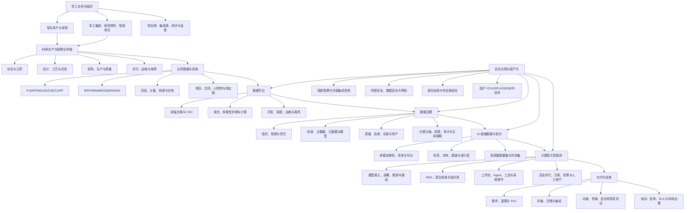

# 军工行业数据平台、数据治理与大模型交付知识地图

> 适用对象：滴普科技项目经理、售前解决方案、交付负责人
>
> 默认场景：中国大陆军工央企、科研院所及军队单位的数据与 AI 项目
>
> 资料边界：只使用公开、合规资料，不涉及涉密数据、装备参数或内部系统信息
>
> 调研日期：2026-07-27

## 0. 先记住的五个结论

1. **军工不是一个单一行业，而是“军队用户—军工集团—科研院所—制造单位—配套供应商—监管与测评机构”组成的复杂体系。** 同一个“数据平台”项目，在集团总部、研究所、制造厂和军队单位中的目标、数据、验收方式会明显不同。
2. **军工数据项目首先是边界和责任项目，其次才是技术项目。** 是否涉密、网络域如何划分、谁能访问、能否导入导出、谁审批、日志如何留存、故障如何恢复，会直接决定架构、实施地点、人员和交付方式。
3. **数据平台、数据治理和大模型不能拆成三套孤立工程。** 正确链路是“业务对象与流程 → 数据接入与治理 → 可追溯的数据/知识资产 → 模型或智能体 → 人在回路的业务执行 → 评测、审计与持续运营”。
4. **军工大模型的近期主战场不是训练一个更大的基础模型，而是私有部署、专业知识库、文档理解、可靠检索、受控执行和可验证验收。** 2026 年军队采购公开样本已经将国产化、离线运行、多格式解析、权限、双人审核、不可篡改日志、备份恢复和驻场运维写入具体要求。
5. **滴普科技的合理切入点是 Data + AI 一体化交付。** FastData 负责多模态数据接入、湖仓、开发治理和语料入口；Deepexi 企业大模型负责企业本体和领域理解；FastAGI/DeepWorks 负责知识、模型、智能体及业务流程执行。但“官网具备某能力”不等于“已满足军工验收”，必须补齐资质、国产化互认证、离线部署、安全审计和恢复测试等证据。

## 1. 证据分级

本文用以下等级约束结论：

| 等级 | 含义 | 使用方式 |
|---|---|---|
| A | 法律法规、现行国家标准、军队采购网、国家数据局、港交所披露 | 可作为当前事实或项目要求样本 |
| B | 厂商官网产品页、厂商公开案例 | 只能证明厂商公开宣称或披露的能力 |
| C | 根据 A/B 证据形成的项目方法和能力映射 | 属于分析结论，需要在具体项目验证 |
| D | 本次公开检索未找到充分证据的事项 | 必须向公司内部或客户确认，不能做肯定承诺 |

## 2. 总知识地图



## 3. 军工行业应该怎么理解

### 3.1 组织地图

当前国资委央企名录中，处于名单前列的相关集团包括中核集团、航天科技、航天科工、航空工业、中国船舶、兵器工业、兵器装备、中国电科和中国航发等。实际项目还可能涉及集团二级单位、研究院、研究所、工厂、专业公司、军工高校和军队单位。不能把集团总部的治理项目经验直接套到研究所或制造厂。

建议把客户分为四类：

| 客户类型 | 第一目标 | 常见数据 | 典型难点 |
|---|---|---|---|
| 集团总部 | 穿透式管理、标准统一、共享复用 | 经营、项目、财务、供应链、质量汇总 | 多级组织、历史平台多、口径不统一 |
| 科研院所 | 科研协同、知识复用、设计与试验效率 | 图纸、规范、报告、试验记录、仿真数据 | 文档多模态、版本复杂、知识隐性化 |
| 制造单位 | 生产透明、质量追溯、交付保障 | BOM、工艺、设备、生产、检测、质量 | OT/IT 融合、实时性、批次和构型追溯 |
| 军队或保障单位 | 安全可控的信息利用和业务支撑 | 规章制度、保障资源、业务记录、知识资料 | 网络隔离、权限严格、审计和恢复要求高 |

### 3.2 典型业务链

不同装备和单位流程不同，但数据项目可以先用以下通用链路理解：

```text
需求/任务
→ 论证与立项
→ 总体与详细设计
→ 工艺设计与试制
→ 试验验证与问题归零
→ 设计/生产状态确认
→ 采购与批量生产
→ 质量检验与交付
→ 运行维护、备件与保障
→ 反馈进入下一轮设计改进
```

数据平台的价值不是把系统数据搬到一起，而是让“需求—设计—工艺—制造—试验—质量—交付—保障”的关键对象可以关联、追溯和复用。

### 3.3 必须熟悉的业务对象

- 型号/项目、任务、合同、计划、里程碑。
- 产品、部组件、零件、构型、BOM、版本和技术状态。
- 图纸、模型、规范、工艺路线、工序、程序和作业指导。
- 设备、工装、刀具、材料、批次、供应商和质量证明。
- 试验任务、条件、过程数据、结果、结论和问题单。
- 缺陷、不合格项、故障、原因、措施、验证与关闭。
- 人员、岗位、组织、权限、密级、知识范围和操作记录。

### 3.4 常见源系统与数据

| 域 | 常见系统 | 主要数据形态 |
|---|---|---|
| 研发设计 | PLM/PDM、CAD/CAE、需求管理、仿真平台 | 图纸、三维模型、BOM、设计文件、仿真结果 |
| 工艺制造 | CAPP、MES、DNC、SCADA/设备采集 | 工艺路线、程序、工单、参数、时序数据 |
| 质量试验 | QMS、LIMS、试验管理、计量管理 | 检验结果、曲线、图像、报告、问题闭环 |
| 经营供应链 | ERP、SRM、SCM、合同与项目管理 | 物料、采购、库存、供应商、计划、成本 |
| 运维保障 | EAM、维修保障、备件管理、IETM | 状态、故障、维修记录、手册、备件 |
| 知识档案 | 档案、文档、标准规范、邮件/协同 | PDF、Word、扫描件、表格、图片、音视频 |

## 4. 三类项目的端到端链路

### 4.1 数据平台建设

```text
业务目标
→ 数据源盘点
→ 网络与部署边界
→ 数据接入/交换
→ 湖仓和多模型存储
→ 数据开发、调度和运维
→ 数据服务/API/指标
→ 安全、容灾和运营
```

核心交付物：

- 现状调研和数据源清单。
- 总体架构、网络部署和数据流转图。
- 数据接入规范、接口清单和同步策略。
- 分层模型、主题域和公共数据模型。
- 开发调度、服务目录、监控告警和运维方案。
- 容量、性能、备份恢复及扩展性测试报告。

### 4.2 数据治理专项

```text
治理目标与范围
→ 组织和责任
→ 业务对象与数据域
→ 标准/主数据/元数据
→ 质量规则和问题闭环
→ 目录、血缘和资产服务
→ 分类分级与权限
→ 指标运营和成熟度改进
```

最容易失败的原因不是工具缺功能，而是：

- 没有业务责任人，所有责任落在信息化部门。
- 只建目录，不建立问题发现、派单、整改、复核和关闭机制。
- 标准停留在 Excel，不进入数据开发、接口和质量规则。
- 一次性盘点后不维护，资产目录和真实系统逐渐脱节。
- 只治理结构化表，忽略图纸、试验报告、标准规范等关键非结构化资产。

### 4.3 大模型/智能体交付

```text
业务任务与风险等级
→ 网络、数据和模型边界
→ 数据/知识盘点与授权
→ 解析、清洗、切分、标签和版本
→ RAG/图谱/本体/微调路线选择
→ 模型服务、知识库、工作流和工具
→ 权限、引用、拒答、审核和审计
→ 离线评测、红队测试、试运行
→ 上线、监控、反馈和持续优化
```

优先级建议：

1. 先做专业知识检索与问答；
2. 再做文档审查、信息抽取和对比；
3. 再做数据查询、分析和报告生成；
4. 最后才让 Agent 调用业务系统执行动作。

动作风险越高，越需要审批、最小权限、可回滚和完整审计。

## 5. 安全合规：必须区分的两条线

### 5.1 涉密线

《保守国家秘密法》于 2024 年修订并自 2024 年 5 月 1 日起施行；修订后的实施条例自 2024 年 9 月 1 日起施行。涉密信息系统的规划、设计、建设、监理和运行维护属于涉密集成活动；承接单位应按业务范围取得相应资质。

项目经理必须先问：

- 项目、系统、数据、场所和人员是否涉密，最高密级是什么？
- 哪些网络域可以互联，哪些必须隔离？
- 供应商以总包、分包、产品提供还是现场服务身份参与？
- 实施人员、开发环境、介质、远程支持和日志导出如何管理？
- 软件升级、模型更新、漏洞修复和备份介质如何进入现场？

**重要边界：** 等保三级、ISO 27001、CMMI 或普通安全认证不能替代涉密信息系统集成资质，也不能自动证明系统满足具体涉密项目要求。

### 5.2 非涉密网络与数据安全线

至少关注：

- 2025 年修正、当前有效的《网络安全法》。
- 《数据安全法》与 2025 年 1 月 1 日施行的《网络数据安全管理条例》。
- 《关键信息基础设施安全保护条例》；国防科技工业被明确列入可能涉及关键信息基础设施的重要行业领域。
- GB/T 22239-2019《网络安全等级保护基本要求》，2025 年复审结论为继续有效。
- GB/T 43697-2024《数据安全技术 数据分类分级规则》。
- 密码应用、个人信息和供应链安全方面的适用要求。

不能把“军工单位”直接等同于“所有系统都是关基”或“所有系统都必须物理隔离”。是否属于关基、是否涉密、采用什么隔离方式，需要由主管部门、客户和项目边界共同确定。

### 5.3 生成式 AI 合规线

《生成式人工智能服务管理暂行办法》主要适用于向境内公众提供生成式 AI 服务。企业或科研机构研发、应用生成式 AI，未向境内公众提供服务的，不直接适用该办法的公众服务监管范围；但数据安全、保密、知识产权、个人信息、网络安全和行业管理要求仍然适用。

工程上仍建议参照：

- GB/T 45654-2025《网络安全技术 生成式人工智能服务安全基本要求》。
- GB/T 45652-2025《网络安全技术 生成式人工智能预训练和优化训练数据安全规范》。
- 训练/知识语料来源、授权、版本和使用范围记录。
- 提示注入、越权检索、敏感信息泄露、模型幻觉和工具误调用测试。
- 模型、语料、向量索引、配置、工作流和日志的备份恢复。

## 6. 公开采购样本透露出的真实验收方向

### 6.1 2025 年数据资源治理项目

军队采购网公开的“数据资源治理应用建设”将采购拆为三块：数据资源治理平台、治理实施服务和驻场运维服务，公开金额约为 130 万、117 万和 57 万元。这说明客户购买的不是单一工具，而是“产品 + 治理实施 + 长期运营”。

### 6.2 2026 年私有大模型项目

某单位 DeepSeek 私有化部署公开需求包括：

- 物理隔离、安全可控、本地智能分析。
- PDF/扫描件、Word、Excel、PPT、TXT 等文档接入和国产 OCR。
- 五类角色以及功能、数据权限。
- 数据录入“提交—审核”双人认证。
- 关键操作全流程日志且要求不可篡改。
- 冷热数据、五年日志、独立备份系统、恢复演示。
- 全栈国产软硬件、兼容认证、驻场和五年质保。
- 问答平均响应时间、并发数和容量预留等量化指标。

另一项 2026 年大模型服务平台采购意向进一步要求国产算力、三款以上模型、模型管理、智能数据处理、知识库、工作流、多模态解析、向量检索和重排序，并给出吞吐、显存、并发和存储指标。

由此得到一个实用验收框架：

| 维度 | 必须形成的证据 |
|---|---|
| 功能 | 用例、结果截图、接口和业务流程闭环 |
| 数据 | 来源、标准、质量、授权、版本、血缘和更新 |
| 模型 | 版本、精度、引用、拒答、幻觉和安全评测 |
| 性能 | 并发、时延、吞吐、容量和稳定性报告 |
| 安全 | 角色权限、审批、日志、导入导出和攻击测试 |
| 国产化 | 软硬件清单、适配记录、互认证和现场验证 |
| 可靠性 | 备份、恢复、RTO/RPO、故障演练和回滚 |
| 服务 | 培训、驻场、SLA、升级机制和问题闭环 |

## 7. 滴普科技产品放到知识地图中的位置

### 7.1 已由公开资料支持的能力

| 产品/能力 | 在军工项目中的候选位置 | 公开证据边界 |
|---|---|---|
| FastData / FastData Foil | 多源接入、CDC、实时湖仓、多模态解析、数据开发治理、目录和质量、AI 语料入口 | 官网明确列出 Iceberg、Flink、Spark、Graph、Vector、Unity Catalog 以及结构化/半结构化/非结构化治理 |
| Deepexi 企业大模型 | 企业本体、业务语义、领域理解、SQL/Python 和受控业务操作 | 官网和 2025 年报披露本体范式、业务知识数据集及 Agent 执行能力 |
| FastAGI | 知识库、模型管理、智能体构建、流程编排、权限和效果评估 | 2025 年报及 2025 年公开产品材料 |
| DeepWorks | 本地工作台、云端智能中枢、知识/工具/流程连接、专家团、人工闸门和可审计执行 | 2026 年当前官网 |
| FDESense / FDE Sense | 源系统字段梳理、主口径、映射、本体建造及数据治理交付辅助 | 2026 年当前官网 |
| DeepSense | 设计、BOM、工艺、设备运维等工业智能体场景 | 2026 年当前官网及年报 |

港交所 2025 年报显示，FastData 收入约 1.605 亿元，FastAGI 收入约 2.545 亿元；FastAGI 占总收入 61.3%。这说明公司已经从以数据平台为主，转向 Data + AI 双产品体系，且 AI 业务成为更主要的收入来源。

### 7.2 一个最接近军工科研场景的公开案例

滴普科技与上海船舶研究设计院的公开案例使用 DeepexiOS、DeepexiGenAI 和 FastAGI，建设船舶法规及入级规范智能体；对中英文研发设计资料和国际法规进行切片与语料处理，形成双语知识库，并使用 embedding、rerank 和意图识别支持设计规范检索。

这个案例能够证明滴普在以下方向有公开实践：

- 工程设计专业文档。
- 中英文标准规范。
- 多规则切片和语料预处理。
- 领域检索、重排和智能体。
- 与设计流程结合的知识应用。

但它**不能单独证明**滴普已经完成涉密军工项目、拥有某项军工资质，或满足某个军工单位的全栈国产化和安全验收。

### 7.3 进入军工项目最需要补证的清单

以下不是判断滴普“没有”，而是本次公开资料不足，需要内部确认：

1. FastAGI、DeepWorks 与 DeepexiOS 当前正式产品关系、版本和报价口径。
2. 完全离线、物理隔离环境下是否存在外部许可、遥测、升级或依赖。
3. 国产 CPU、GPU/NPU、操作系统、数据库、中间件、OCR、向量库的兼容矩阵和互认证材料。
4. 是否具备或通过合作伙伴覆盖涉密信息系统集成所需资质范围。
5. 数据、文档、知识库、分段、向量索引和 Agent 工具的细粒度权限是否继承源系统权限。
6. 双人审核、导入导出审批、日志防篡改、介质管理和离线补丁机制。
7. 备份范围是否覆盖模型、语料、索引、配置、工作流和智能体；RTO/RPO 是否经过恢复演示。
8. 国产算力上的并发、时延、吞吐、长上下文和批量解析基准。
9. 回答引用、证据定位、拒答、越权检索、提示注入和工具误调用的评测报告。
10. SBOM、第三方组件许可证、漏洞响应、版本回滚和长期支持策略。

## 8. 同类产品对照

这不是厂商排名，而是用于理解竞争形态的公开资料对照。具体项目必须以当期版本、报价、PoC 和证明文件为准。

| 厂商/组合 | 数据底座 | 治理 | AI/智能体 | 公开定位与相对特点 | 对滴普的启示 |
|---|---|---|---|---|---|
| **滴普科技：FastData + Deepexi + FastAGI/DeepWorks** | 湖仓、CDC、多模型引擎、多模态数据 | 开发治理、目录、质量、本体 | 企业模型、知识库、Agent、Skills、执行闭环 | Data + AI 一体化，本体和 FDE 交付模式突出 | 把一体化优势转成军工可验收证据，明确新旧产品口径 |
| **星环科技：TDC/AI-Ready Data Platform + Sophon LLMOps** | 自研大数据、多模型数据库、容器数据云 | 全链治理、知识构建 | 语料、知识、训练、模型管理、应用编排 | 数据基础设施和多模型存储能力强，强调私有数据云 | 滴普需要证明底层性能、规模、复杂负载和国产化部署能力 |
| **华为：DataArts + ModelArts/盘古 + 华为云 Stack** | 云、存算、数据治理生产线 | DataArts 全生命周期治理 | 数据工程、模型训练部署、Agent、行业模型 | 芯片—云—数据—模型全栈和生态适配能力强 | 滴普应突出更轻量、场景更快、交付更聚焦，同时建立生态适配 |
| **亚信科技：DataAtlas/DataOS + TAC MaaS + Ontology + Agent** | 多模态存储、虚拟化、DataOps | 主动元数据、质量、安全、资产 | 模型全生命周期、本体、智能体和治理副驾 | 产品覆盖面与滴普高度相近，官网明确 50+ 信创互认证 | 应重点比较本体落地、Agent 治理、交付效率和工业/军工场景 |
| **数澜科技：数据平台 + 大模型平台 + 智能体 + 超级云** | 数据中台、混合云、40+ 数据源 | 数据标准、质量和资产 | 数据准备、知识工程、训推、Agent 和人工介入 | 同样强调数据到 AI 全链路，平台轻量与政企经验是竞争点 | 应通过复杂工业数据、实时湖仓和 FDE 方法形成差异 |
| **普元信息：数据资产/主数据/治理 + iPaaS/低代码** | 集成与服务平台 | 元数据、标准、质量、主数据、资产和 API | AI 主要作为治理后数据的消费与增强 | 治理方法、主数据和央国企客户基础突出 | 治理专项中不能只讲湖仓和 Agent，要补强制度、主数据及运营方法 |

### 8.1 滴普的建议竞争叙事

不要只说“我们有数据中台和大模型”。更有效的叙事是：

> 滴普用 FastData 将结构化数据、工程文档、图纸、表格和历史知识统一接入、治理并形成可追溯的数据与语料资产；用 Deepexi 企业大模型和企业本体理解客户独有的对象、关系、规则与流程；再通过 FastAGI/DeepWorks 把知识问答、数据分析和业务动作装配成有权限、有依据、有人审、可回滚、可审计的智能体。项目按客户网络和保密边界私有部署，并用国产化适配、性能、安全、备份恢复和业务指标共同验收。

这段话中最后一句只有在内部能力和项目证据确认后才能写入正式投标承诺。

## 9. 军工大模型的优先场景

### 第一梯队：低动作风险、价值易验证

- 标准规范、制度、技术文档和档案的知识检索。
- 中英文规范对比、条款定位、版本差异和引用回答。
- 试验报告、质量报告、故障报告的信息抽取和关联。
- 文档分类、元数据补全、标签推荐和知识入库辅助。
- 数据平台使用、数据标准和治理规则问答。

### 第二梯队：需要业务规则和人工复核

- 设计审查辅助、规范符合性检查。
- BOM、工艺、质量问题和历史案例关联分析。
- 自然语言取数、指标解释和经营/项目分析。
- 设备故障诊断、维修知识推荐和备件核对。
- 数据质量异常原因分析与整改建议。

### 第三梯队：高风险受控执行

- 自动修改设计、工艺或主数据。
- 自动下发生产、采购或维修指令。
- 跨系统自动审批和数据导出。
- 直接用于关键决策的预测与建议。

第三梯队必须设置明确的人工闸门、授权边界、仿真或沙箱、回滚和责任链。

## 10. 项目经理的需求访谈清单

### 10.1 目标与范围

1. 当前最想缩短哪一段业务时间，或降低哪一种风险？
2. 目标用户是谁，在哪个岗位、哪个网络、什么场所使用？
3. 首期只验证一个场景，还是建设集团级平台？
4. 成功的业务指标是什么：时间、准确率、召回率、质量问题数还是人员投入？

### 10.2 安全与部署

5. 项目及数据是否涉密，最高密级和知悉范围是什么？
6. 网络域、数据域和安全域如何划分？允许哪些单向或双向交换？
7. 是否属于关基或需要等保、密评及其他专项测评？
8. 是否要求全栈国产化，指定或允许哪些软硬件品牌？
9. 是否允许远程支持、联网许可、在线升级或云端调用？

### 10.3 数据与治理

10. 首期数据源、责任部门、数据量、增量和更新频率是什么？
11. 结构化、文档、图纸、图片、音视频和时序数据分别占多少？
12. 是否已经有数据标准、主数据、目录、血缘、质量规则和分类分级？
13. 源系统权限如何传递到湖仓、知识库、向量索引和回答结果？
14. 数据问题由谁确认、整改、复核和关闭？

### 10.4 模型与知识

15. 场景适合 RAG、本体/图谱、微调还是规则引擎？为什么？
16. 回答是否必须给出处、页码、版本和原文片段？
17. 无证据、证据冲突或权限不足时，系统应如何拒答或升级？
18. 谁可以发布、更新、下架知识和智能体？是否需要双人审核？
19. 允许 Agent 调用哪些系统和工具，哪些动作必须人工确认？

### 10.5 验收与运营

20. 功能、性能、安全、国产化和业务成效分别如何验收？
21. 测试集由谁提供，是否包含困难样本、越权样本和攻击样本？
22. RTO、RPO、日志留存年限和恢复演示要求是什么？
23. 驻场人数、响应时间、升级频率和质保期如何要求？
24. 项目结束后由谁持续维护数据、知识、评测集和 Agent？

## 11. 7 天快速学习计划

每天建议投入 90—120 分钟，并产生一个可复用交付物。

| 天 | 学习内容 | 最小产出 | 验收 |
|---|---|---|---|
| Day 1 | 组织体系、客户类型、科研生产业务链 | 一页“客户—业务—系统”地图 | 能解释研究所与制造厂的数据项目差异 |
| Day 2 | 保密、网络/数据安全、等保、关基与资质 | 安全边界检查表 | 能说明涉密、等保和关基不能互相替代 |
| Day 3 | 数据平台：接入、湖仓、多模型、服务与运维 | 一张目标架构图 | 能从源系统讲到数据服务和容灾 |
| Day 4 | 数据治理：标准、主数据、元数据、质量、资产 | 一条问题闭环流程 | 能解释为什么目录建设不等于治理成功 |
| Day 5 | 大模型：数据集、RAG、本体、评测、Agent 安全 | 一个知识问答验收表 | 能设计引用、拒答、越权和恢复测试 |
| Day 6 | 滴普产品与五类竞品 | 产品—需求—证据矩阵 | 每个能力都能指出证据或标成待确认 |
| Day 7 | 模拟客户访谈与方案汇报 | 10 页以内方案或 15 分钟讲解 | 能讲清目标、边界、架构、验收和风险 |

明天即可开始的最小动作：

1. 用本文第 10 节对一个假想“研究所专业知识助手”做 30 分钟需求访谈演练。
2. 只选择 500—1000 份脱敏规范文档，设计“入库—审核—检索—引用—更新—下架”流程。
3. 把 FastData、Deepexi、FastAGI/DeepWorks 分别映射到流程步骤，并把没有证据的格子标红。

## 12. 30 天进阶路线

### 第 1 周：建立行业语言

- 完成 7 天学习计划。
- 熟悉 20 个核心业务对象和 10 类源系统。
- 能画出集团、研究所、制造厂三种客户的差异地图。

### 第 2 周：形成方案能力

- 各完成一份数据平台、治理专项和大模型项目蓝图。
- 为每份蓝图补充网络、安全、国产化、备份和运维章节。
- 用公开采购参数反推功能、性能和验收清单。

### 第 3 周：完成滴普产品化映射

- 获取公司内部正式产品架构、版本、兼容矩阵和案例材料。
- 完成一份“能力—版本—证明文件—负责人”台账。
- 选择星环、华为、亚信和数澜做一次真实 PoC 维度对照。

### 第 4 周：完成一次模拟交付

- 选一个低风险场景，例如“工程规范智能检索”。
- 形成需求说明、数据清单、架构、实施计划、评测集和验收报告模板。
- 组织一次内部评审，让安全、产品、交付和业务四类角色分别挑战方案。

## 13. 建议阅读资料

### 13.1 第一优先级：先读完

1. [《中华人民共和国保守国家秘密法（2024 修订）》](https://gdca.miit.gov.cn/zwgk/zcwj/flfg/art/2024/art_4870c40a6f8249389684d03786d41639.html)（A）
2. [《中华人民共和国保守国家秘密法实施条例》](https://www.ssf.gov.cn/portal/rootfiles/2024/08/23/1726098035285451-1726098035293140.pdf)（A）
3. [《涉密信息系统集成资质管理办法》](https://www.gjbmj.gov.cn/n1/2025/1212/c461457-40623276.html)（A）
4. [GB/T 36073-2025《数据管理能力成熟度评估模型》](https://openstd.samr.gov.cn/bzgk/std/newGbInfo?hcno=22559F9C7BF9EAC6A3927223FE33CE20)（A；2026-07-01 已替代 2018 版）
5. [GB/T 44109-2024《信息技术 大数据 数据治理实施指南》](https://std.samr.gov.cn/gb/search/gbDetailed?id=19B8508AEDE64286E06397BE0A0A616D)（A）
6. [GB/T 43697-2024《数据安全技术 数据分类分级规则》](https://openstd.samr.gov.cn/bzgk/std/newGbInfo?hcno=F0C385EDC38CBF277AEC021F23126ADE)（A）
7. [GB/T 45654-2025《网络安全技术 生成式人工智能服务安全基本要求》](https://www.tc260.org.cn/portal/article/1/20250630122232)（A）
8. [《高质量数据集建设指引》](https://www.nda.gov.cn/sjj/swdt/xwfb/0830/ff808081-96b466bd-0198-fb102e73-1690.pdf)（A）

### 13.2 第二优先级：理解真实采购

1. [数据资源治理应用建设招标公告](https://www.plap.mil.cn/freecms/site/juncai/ggxx/info/2025/8a1d0011956a9ba40195b27fedfc0c93.html)（A）
2. [某单位 DeepSeek 私有化部署采购意向](https://www.plap.mil.cn/freecms/site/juncai/ggxx/info/2026/8a1d03d39be8962f019c2cc87db26c20.html)（A）
3. [大模型服务平台建设采购意向](https://www.plap.mil.cn/freecms/site/juncai/ggxx/info/2026/8a1d04a39d897f6e019e0c37726f39b4.html)（A）
4. [某大模型升级征求意见公告](https://www.plap.mil.cn/freecms/site/juncai/ggxx/info/2026/8a1d00679dfb499c019dfc4fb450219d.html)（A）
5. [辽宁材料实验室科研大数据平台招标公告](https://www.ccgp.gov.cn/cggg/dfgg/gkzb/202505/t20250506_24540990.htm)（A；非军工，但科研数据链路非常有参考价值）

### 13.3 第三优先级：滴普产品与案例

1. [FastData 产品页](https://www.deepexi.com/product/fastdata)（B）
2. [FastData Foil 产品页](https://www.deepexi.com/product/fastdata-foil)（B）
3. [Deepexi 企业大模型产品页](https://www.deepexi.com/product/deepexi)（B）
4. [DeepWorks 官网](https://deepworks.deepexi.com/)（B）
5. [滴普科技 2025 年度报告](https://www.hkexnews.hk/listedco/listconews/sehk/2026/0408/2026040802741_c.pdf)（A；公司法定披露）
6. [上海船舶研究设计院智能设计助手案例](https://deepexi.com/news-detail/86)（B）

### 13.4 第四优先级：竞品官方材料

1. [星环 AI-Ready Data Platform](https://www.transwarp.cn/product/ai-ready-data-platform)（B）
2. [星环 TDC 数据云](https://www.transwarp.cn/product/tdc/)（B）
3. [华为 DataArts 与 ModelArts 数智融合介绍](https://www.huawei.com/cn/publications/huaweitech/202301)（B）
4. [华为云 Stack 盘古大模型使用指南](https://support.huawei.com/enterprise/zh/doc/EDOC1100455551/5b2f47ef)（B）
5. [亚信 DataAtlas 数据基础平台](https://www.asiainfo.com/zh_cn/product_aisware_DataAtlas.html)（B）
6. [亚信 TAC MaaS 平台](https://www.asiainfo.com/zh_cn/product_aisware_AI.html)（B）
7. [数澜科技产品体系](https://www.dtwave.com/)（B）
8. [普元数据资产管理平台](https://www.primeton.com/products/zc/)（B）

## 14. 最终判断

军工数据与大模型项目的核心约束不是模型能力，而是**可信数据能否在正确边界内被正确的人、模型和流程使用，并留下可审计、可恢复、可持续运营的证据**。

对滴普科技而言，FastData、Deepexi 和 FastAGI/DeepWorks 已经能组成一条有吸引力的 Data + AI 产品链。下一步最值得优先完成的不是再增加一张宏大架构图，而是建立一份军工交付证据包：

```text
正式产品版本与架构
+ 离线部署说明
+ 国产化兼容矩阵与证明
+ 权限/审批/日志能力说明
+ 备份恢复与升级方案
+ 性能和安全评测
+ 脱敏行业案例
+ 项目资质及合作伙伴边界
+ 标准化实施与验收模板
```

这份证据包决定了产品能力能否转化为客户信任、投标应答和最终验收。
